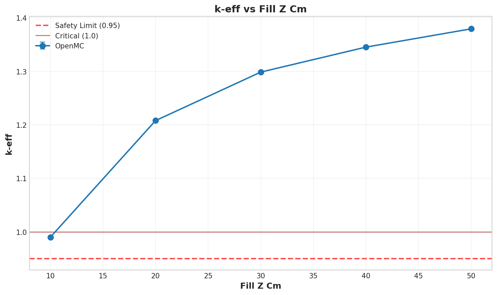

# Criticality Analysis Report

**Experiment:** Centrifuge unit cell OpenMC parity sweep
**Generated:** 2026-03-30 23:20:41
**Run Directory:** `/mnt/c/Users/AndyLee/Projects/crit-buddy/certifications/centrifuge-unit-cell/2026-03-30-r1/openmc/runs/centrifuge-air-library/2026-03-30_23-18-26`

---

## Executive Summary

**Result: MIXED SAFETY STATUS**

- SAFE: 0 cases (0.0%)
- MARGINAL: 1 cases (20.0%)
- CRITICAL: 4 cases (80.0%)

| Metric | Value |
|--------|-------|
| Total Cases | 5 |
| k-eff Range | 0.9900 - 1.3794 |
| k-eff Mean | 1.2442 |

---

## Experiment Configuration

**Model:** `centrifuge-unit-cell`

### Swept Parameters

| Parameter | Values | Count |
|-----------|--------|-------|
| `fill_z_cm` | 10.0, 20.0, 30.0, 40.0, 50.0 | 5 |

### Fixed Parameters

| Parameter | Value |
|-----------|-------|
| `enrichment_pct` | 20.2 |
| `h_to_u` | 5.0 |
| `source_z_cm` | 10.0 |
| `vessel_height_cm` | 100.0 |
| `x_boundary_type` | reflective |
| `y_boundary_type` | reflective |
| `z_boundary_type` | reflective |

---

## Results Visualization

### Parameter Sweeps

---

## Detailed Results

Click to expand full results table (5 cases)

| case | keff | std | status | fill_z_cm |
| --- | --- | --- | --- | --- |
| case_1 | 0.99000 | 0.00103 | MARGINAL | 10.0 |
| case_2 | 1.20785 | 0.00104 | CRITICAL | 20.0 |
| case_3 | 1.29851 | 0.00106 | CRITICAL | 30.0 |
| case_4 | 1.34520 | 0.00111 | CRITICAL | 40.0 |
| case_5 | 1.37936 | 0.00105 | CRITICAL | 50.0 |

---

## Analysis Assumptions

This analysis uses **conservative (bounding)** assumptions:

| Assumption | Value | Conservative? |
|------------|-------|---------------|
| Reflector | unknown | ? |
| Fill Level | 100% | ✓ |

---

## Conclusions

A **safe operating envelope** exists within the analyzed parameter range.

Refer to the heatmap and status plots for specific safe/unsafe boundaries.

---

*Report generated by Crit-Buddy*