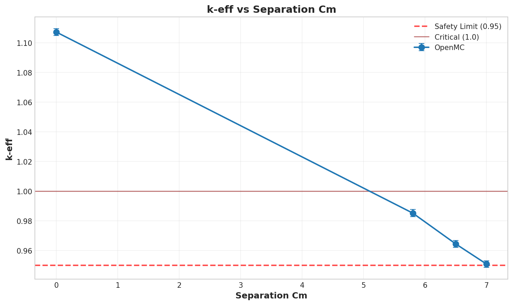

# Criticality Analysis Report

**Experiment:** Pipe Cross Andy Reference - OpenMC parity sweep
**Generated:** 2026-03-30 18:21:04
**Run Directory:** `/mnt/c/Users/AndyLee/Projects/crit-buddy/certifications/pipe-cross-model/2026-03-24-r1/openmc/runs/cert-artifacts/2026-03-30_18-19-36`

---

## Executive Summary

**Result: MIXED SAFETY STATUS**

- SAFE: 0 cases (0.0%)
- MARGINAL: 3 cases (75.0%)
- CRITICAL: 1 cases (25.0%)

| Metric | Value |
|--------|-------|
| Total Cases | 4 |
| k-eff Range | 0.9508 - 1.1071 |
| k-eff Mean | 1.0018 |

---

## Experiment Configuration

**Model:** `pipe-cross-model`

### Swept Parameters

| Parameter | Values | Count |
|-----------|--------|-------|
| `separation_cm` | 0.0, 5.8, 6.5, 7.0 | 4 |

### Fixed Parameters

| Parameter | Value |
|-----------|-------|
| `cross_mode` | xz |
| `enrichment_pct` | 20.19 |
| `fuel_outer_radius_cm` | 5.4102 |
| `gas_core_radius_cm` | 4.4102 |
| `moderator_density_g_cm3` | 1.0 |
| `pipe_outer_radius_cm` | 5.715 |
| `pipe_size` | custom |
| `pipe_wall_thickness_cm` | 0.3048 |
| `uf6_density_g_cm3` | 0.0127 |
| `uo2f2_density_g_cm3` | 6.37 |
| `wall_material` | aluminum |
| `x_boundary_type` | reflective |
| `y_boundary_type` | reflective |
| `z_boundary_type` | reflective |

---

## Results Visualization

### Parameter Sweeps

---

## Detailed Results

Click to expand full results table (4 cases)

| case | keff | std | status | separation_cm |
| --- | --- | --- | --- | --- |
| case_1 | 1.10710 | 0.00116 | CRITICAL | 0.0 |
| case_2 | 0.98513 | 0.00124 | MARGINAL | 5.8 |
| case_3 | 0.96435 | 0.00117 | MARGINAL | 6.5 |
| case_4 | 0.95080 | 0.00111 | MARGINAL | 7.0 |

---

## Analysis Assumptions

This analysis uses **conservative (bounding)** assumptions:

| Assumption | Value | Conservative? |
|------------|-------|---------------|
| Reflector | unknown | ? |
| Fill Level | 100% | ✓ |

---

## Conclusions

A **safe operating envelope** exists within the analyzed parameter range.

Refer to the heatmap and status plots for specific safe/unsafe boundaries.

---

*Report generated by Crit-Buddy*