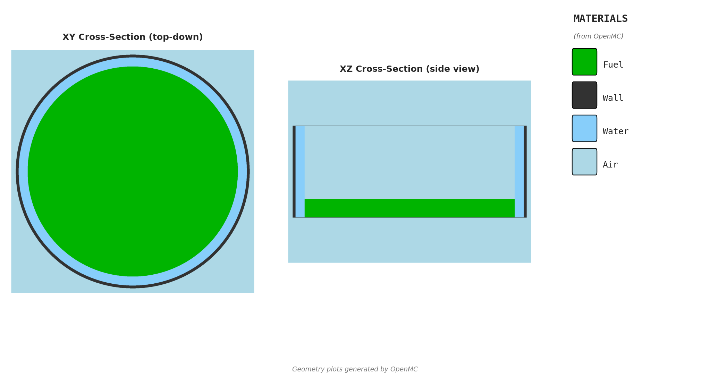

# Criticality Analysis Request: Centrifuge Unit Cell

## Model Scope

Canonical single-centrifuge unit-cell model with reflective square-cell boundaries.
This request is for the maintained `centrifuge-unit-cell` model, not the older
maker-array or Steven film naming.

For the full model writeup and assumptions, see
`models/centrifuge-unit-cell/MODEL.md`.

## Visualization

Preview generated from
`models/centrifuge-unit-cell/openmc/visualization_config.yaml` using `--validate`.

## Design Inputs

- Inner radius
- Water film thickness
- Wall thickness
- Vessel height
- Fill height inside the vessel
- Enrichment

| Parameter | Value | Notes |
|-----------|-------|-------|
| `enrichment_pct` | | U-235 weight percent enrichment |
| `inner_radius_cm` | | Inner fuel radius of the centrifuge vessel |
| `water_film_thickness_cm` | | Water-film thickness outside the fuel region |
| `wall_thickness_cm` | | Steel wall thickness; end-cap thickness follows this value |
| `vessel_height_cm` | | Total vessel height from bottom to top |
| `fill_height_cm` | | Fill height above vessel bottom; use `[value1, value2, ...]` for sweeps |

## Certified Baseline

- `inner_radius_cm = 11.70`
- `water_film_thickness_cm = 1.0`
- `wall_thickness_cm = 0.3175`
- `vessel_height_cm = 100.0`
- `fill_height_cm = 20.0`
- Wall material is fixed to stainless steel
- End-cap thickness follows `wall_thickness_cm`
- Air, water, and reflected unit-cell boundaries follow the certified baseline

These baseline values reproduce the current blessed parity checkpoint, but the
geometry inputs above are now valid sweep parameters in the maintained model.

## Analyst-Managed Assumptions

These are not intended RE inputs on the template:

- UO2F2 chemistry / moderation assumption
- Source placement details
- Boundary condition overrides
- Internal air / water material definitions

## References

- Copy-paste study config:
  `models/centrifuge-unit-cell/openmc/example_config.yaml`
- Validation preview config:
  `models/centrifuge-unit-cell/openmc/visualization_config.yaml`
- Current certification checkpoint:
  `certifications/centrifuge-unit-cell/2026-03-30-r1/results.md`

## Instructions

1. Copy this issue to a working ticket. Do not edit the template directly.
2. Fill in the **Design Inputs** table.
3. Use `[value1, value2, ...]` for parameter sweeps.
4. Add any design rationale, expected limits, or geometry notes below.
5. Move the working ticket to **Ready for run** when complete.

## Notes

## Outputs

Typical outputs attached back to the working ticket:

- `results.csv`
- `REPORT.md`
- plots generated for the requested sweep

---

**Model:** `centrifuge-unit-cell`
