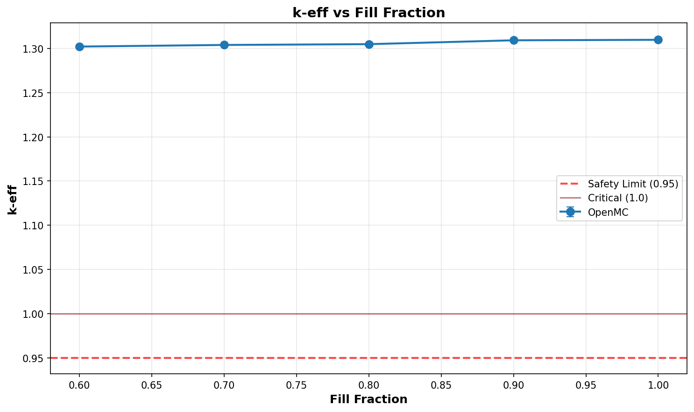

# Criticality Analysis Report

**Experiment:** UF6 Dry - Infinite Array
**Generated:** 2026-02-12 22:29:23
**Run Directory:** `/mnt/c/Users/AndyLee/Projects/crit-buddy/experiments/crit_requests/06_cylinder_array_3d/runs/uf6_dry/2026-02-12_22-26-09`

---

## Executive Summary

**Result: ALL CASES CRITICAL**

All 5 cases exceeded criticality (k-eff + 2σ ≥ 1.0). 
No safe geometry exists within the analyzed parameter range under these conditions.

| Metric | Value |
|--------|-------|
| Total Cases | 5 |
| k-eff Range | 1.3022 - 1.3098 |
| k-eff Mean | 1.3060 |

---

## Experiment Configuration

**Problem Template:** `cylinder_array_3d`

### Swept Parameters

| Parameter | Values | Count |
|-----------|--------|-------|
| `fill_fraction` | 0.6, 0.7, 0.8, 0.9, 1.0 | 5 |

### Fixed Parameters

| Parameter | Value |
|-----------|-------|
| `boundary_type` | reflective |
| `cols` | 4 |
| `enrichment` | 21 |
| `environment_material` | humid_air |
| `fissile_density` | 5.09 |
| `fissile_material` | uf6 |
| `gap_xy_cm` | 12.7 |
| `gap_z_cm` | 7.62 |
| `h_to_u_ratio` | 0.0 |
| `height_cm` | 100.0 |
| `layers` | 5 |
| `radius_cm` | 12.7 |
| `reflector_thickness_cm` | 6.35 |
| `rows` | 3 |
| `void_material` | humid_air |
| `wall_material` | steel |
| `wall_thickness_cm` | 0.3175 |

---

## Results Visualization

### Parameter Sweeps

---

## Detailed Results

Click to expand full results table (5 cases)

| case | keff | std | status | fill_fraction |
| --- | --- | --- | --- | --- |
| case_1 | 1.30216 | 0.00065 | CRITICAL | 0.6 |
| case_2 | 1.30397 | 0.00077 | CRITICAL | 0.7 |
| case_3 | 1.30487 | 0.00067 | CRITICAL | 0.8 |
| case_4 | 1.30924 | 0.00067 | CRITICAL | 0.9 |
| case_5 | 1.30979 | 0.00070 | CRITICAL | 1.0 |

---

## Analysis Assumptions

This analysis uses **conservative (bounding)** assumptions:

| Assumption | Value | Conservative? |
|------------|-------|---------------|
| Reflector | unknown | ? |
| Fill Level | 100% | ✓ |

---

## Conclusions

At the analyzed conditions, **no safe geometry exists** within the parameter range:

- fill_fraction: 0.6 - 1.0

**Recommendations:**
- Consider lower enrichment levels
- Use favorable geometry (pipes instead of open vessels)
- Implement administrative controls (mass limits)

---

*Report generated by Crit-Buddy*