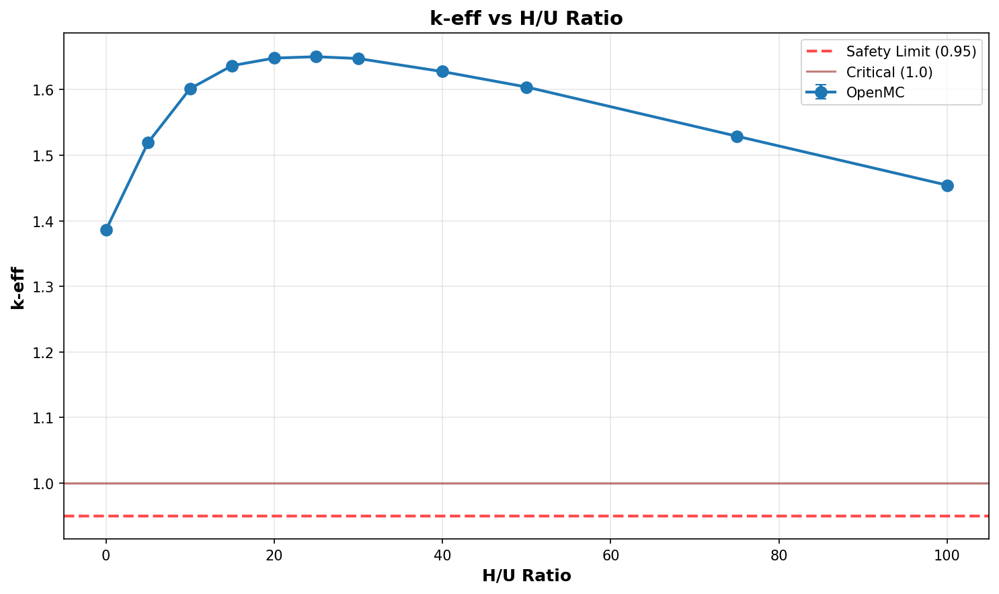

# Criticality Analysis Report

**Experiment:** UO2F2 H/U Sweep - Infinite Array
**Generated:** 2026-02-13 09:53:23
**Run Directory:** `/mnt/c/Users/AndyLee/Projects/crit-buddy/experiments/crit_requests/06_cylinder_array_3d/runs/uo2f2_hu_sweep/2026-02-13_09-41-51`

---

## Executive Summary

**Result: ALL CASES CRITICAL**

All 11 cases exceeded criticality (k-eff + 2σ ≥ 1.0). 
No safe geometry exists within the analyzed parameter range under these conditions.

| Metric | Value |
|--------|-------|
| Total Cases | 11 |
| k-eff Range | 1.3858 - 1.6501 |
| k-eff Mean | 1.5730 |

---

## Experiment Configuration

**Problem Template:** `cylinder_array_3d`

### Swept Parameters

| Parameter | Values | Count |
|-----------|--------|-------|
| `h_to_u_ratio` | 0 ... 100 | 11 |

### Fixed Parameters

| Parameter | Value |
|-----------|-------|
| `boundary_type` | reflective |
| `cols` | 4 |
| `enrichment` | 21 |
| `environment_material` | humid_air |
| `fill_fraction` | 1.0 |
| `fissile_density` | 5.09 |
| `fissile_material` | uo2f2 |
| `gap_xy_cm` | 12.7 |
| `gap_z_cm` | 7.62 |
| `height_cm` | 100.0 |
| `layers` | 5 |
| `radius_cm` | 12.7 |
| `reflector_thickness_cm` | 6.35 |
| `rows` | 3 |
| `void_material` | humid_air |
| `wall_material` | steel |
| `wall_thickness_cm` | 0.3175 |

---

## Results Visualization

### Parameter Sweeps

---

## Detailed Results

Click to expand full results table (11 cases)

| case | keff | std | status | h_to_u_ratio |
| --- | --- | --- | --- | --- |
| case_1 | 1.38584 | 0.00061 | CRITICAL | 0 |
| case_2 | 1.51910 | 0.00081 | CRITICAL | 5 |
| case_3 | 1.60136 | 0.00079 | CRITICAL | 10 |
| case_4 | 1.63649 | 0.00081 | CRITICAL | 15 |
| case_5 | 1.64797 | 0.00075 | CRITICAL | 20 |
| case_6 | 1.65007 | 0.00084 | CRITICAL | 25 |
| case_7 | 1.64730 | 0.00089 | CRITICAL | 30 |
| case_8 | 1.62743 | 0.00084 | CRITICAL | 40 |
| case_9 | 1.60386 | 0.00076 | CRITICAL | 50 |
| case_10 | 1.52891 | 0.00075 | CRITICAL | 75 |
| case_11 | 1.45425 | 0.00082 | CRITICAL | 100 |

---

## Analysis Assumptions

This analysis uses **conservative (bounding)** assumptions:

| Assumption | Value | Conservative? |
|------------|-------|---------------|
| Reflector | unknown | ? |
| Fill Level | 100% | ✓ |

---

## Conclusions

At the analyzed conditions, **no safe geometry exists** within the parameter range:

- h_to_u_ratio: 0 - 100

**Recommendations:**
- Consider lower enrichment levels
- Use favorable geometry (pipes instead of open vessels)
- Implement administrative controls (mass limits)

---

*Report generated by Crit-Buddy*