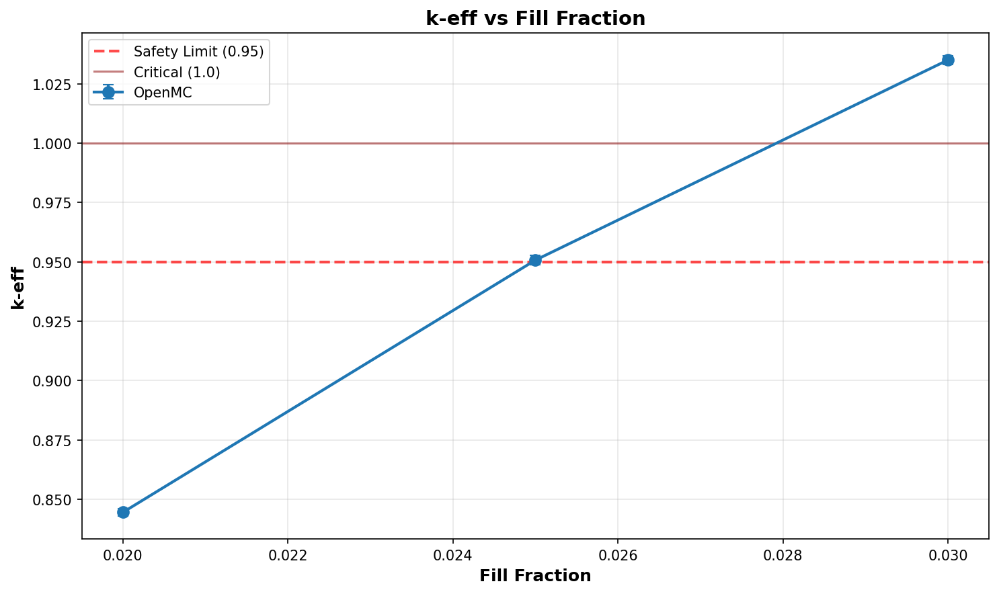

# Criticality Analysis Report

**Experiment:** UO2F2 Wet - Peak Moderation (H/U=25)
**Generated:** 2026-02-13 10:32:40
**Run Directory:** `/mnt/c/Users/AndyLee/Projects/crit-buddy/experiments/crit_requests/06_cylinder_array_3d/runs/uo2f2_wet_peak/2026-02-13_10-18-32`

---

## Executive Summary

**Result: MIXED SAFETY STATUS**

- SAFE: 1 cases (33.3%)
- MARGINAL: 1 cases (33.3%)
- CRITICAL: 1 cases (33.3%)

| Metric | Value |
|--------|-------|
| Total Cases | 3 |
| k-eff Range | 0.8445 - 1.0350 |
| k-eff Mean | 0.9434 |

---

## Experiment Configuration

**Problem Template:** `cylinder_array_3d`

### Swept Parameters

| Parameter | Values | Count |
|-----------|--------|-------|
| `fill_fraction` | 0.02, 0.025, 0.03 | 3 |

### Fixed Parameters

| Parameter | Value |
|-----------|-------|
| `boundary_type` | reflective |
| `cols` | 4 |
| `enrichment` | 21 |
| `environment_material` | humid_air |
| `fissile_density` | 5.09 |
| `fissile_material` | uo2f2 |
| `gap_xy_cm` | 12.7 |
| `gap_z_cm` | 7.62 |
| `h_to_u_ratio` | 25 |
| `height_cm` | 100.0 |
| `layers` | 5 |
| `radius_cm` | 12.7 |
| `reflector_thickness_cm` | 6.35 |
| `rows` | 3 |
| `void_material` | humid_air |
| `wall_material` | steel |
| `wall_thickness_cm` | 0.3175 |

---

## Results Visualization

### Parameter Sweeps

---

## Detailed Results

Click to expand full results table (3 cases)

| case | keff | std | status | fill_fraction |
| --- | --- | --- | --- | --- |
| case_1 | 0.84449 | 0.00077 | SAFE | 0.02 |
| case_2 | 0.95071 | 0.00100 | MARGINAL | 0.025 |
| case_3 | 1.03499 | 0.00093 | CRITICAL | 0.03 |

---

## Analysis Assumptions

This analysis uses **conservative (bounding)** assumptions:

| Assumption | Value | Conservative? |
|------------|-------|---------------|
| Reflector | unknown | ? |
| Fill Level | 100% | ✓ |

---

## Conclusions

A **safe operating envelope** exists within the analyzed parameter range.

Refer to the heatmap and status plots for specific safe/unsafe boundaries.

---

*Report generated by Crit-Buddy*