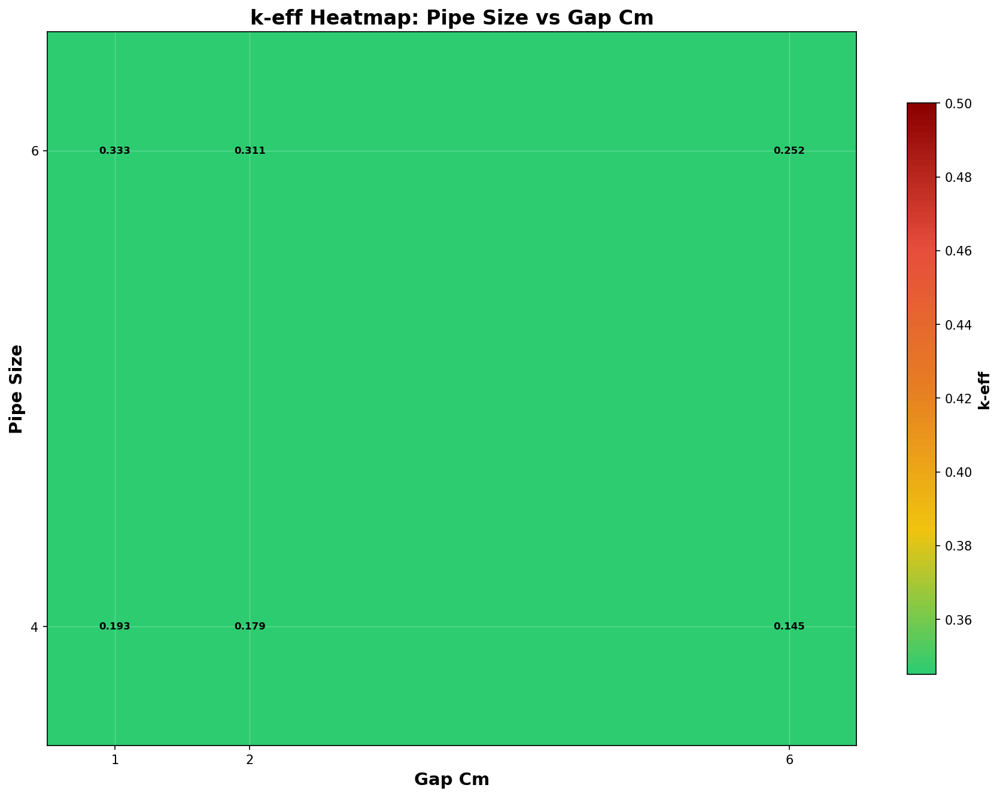
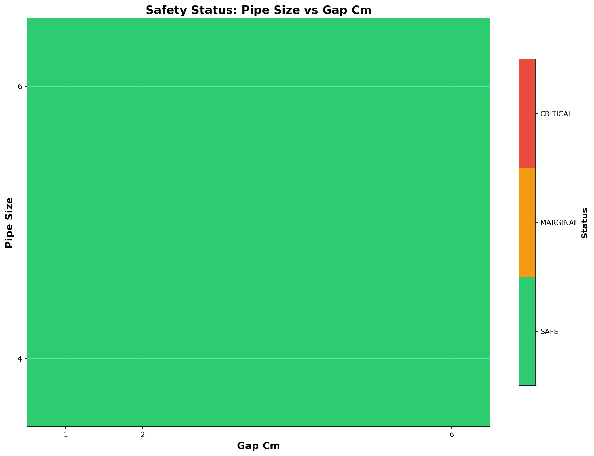
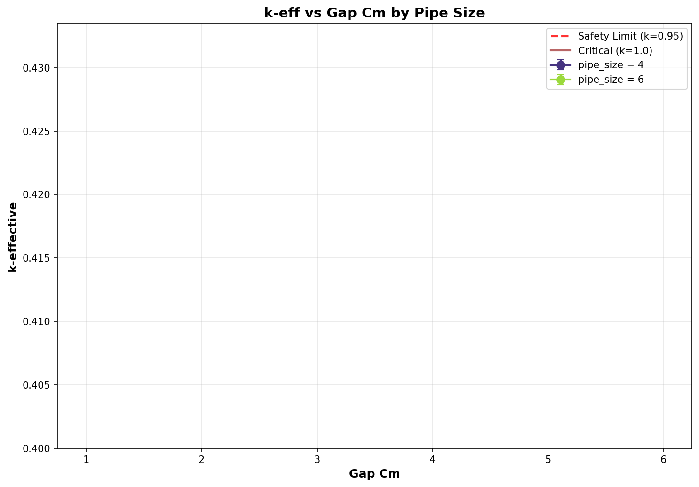
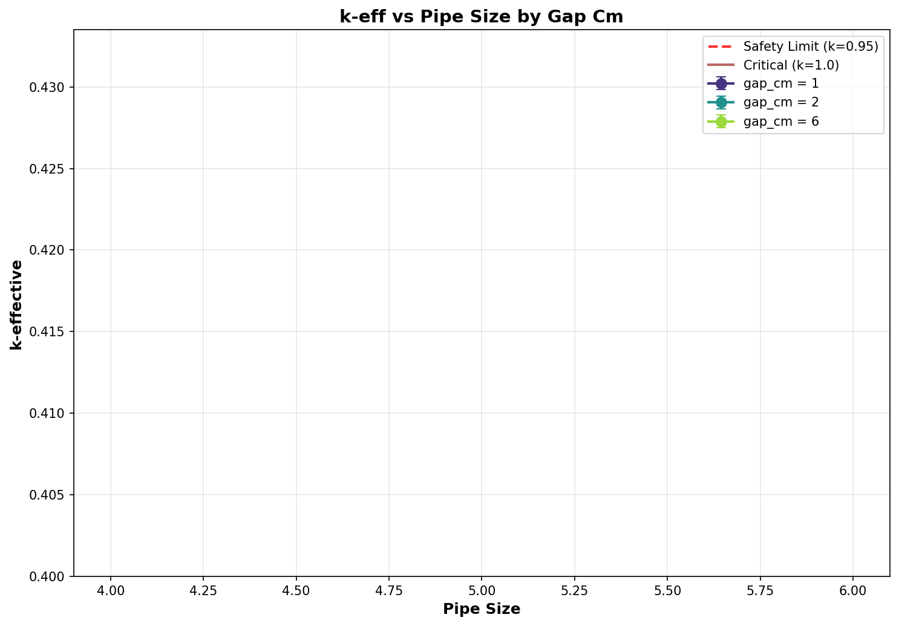

# Criticality Analysis Report

**Experiment:** Pipe Array - UF6 (100% fill)
**Generated:** 2026-02-17 17:19:00
**Run Directory:** `/mnt/c/Users/AndyLee/Projects/crit-buddy/experiments/crit_requests/08_pipe_array_3d/runs/uf6/2026-02-17_17-17-17`

---

## Executive Summary

**Result: ALL CASES SAFE**

All 6 cases are subcritical (k-eff + 2σ < 0.95).

| Metric | Value |
|--------|-------|
| Total Cases | 6 |
| k-eff Range | 0.1448 - 0.3335 |
| k-eff Mean | 0.2355 |

---

## Experiment Configuration

**Problem Template:** `parallel_pipes`

### Swept Parameters

| Parameter | Values | Count |
|-----------|--------|-------|
| `gap_cm` | 1, 2, 6 | 3 |
| `pipe_size` | 4, 6 | 2 |

### Fixed Parameters

| Parameter | Value |
|-----------|-------|
| `enrichment` | 21 |
| `fissile_density` | 5.09 |
| `fissile_material` | uf6 |
| `h_to_u` | 0.0 |
| `length_cm` | 900 |
| `num_pipes` | 2 |
| `rows` | 3 |
| `wall_material` | ss304 |
| `water_density` | 0.001 |
| `water_thickness_cm` | 30 |

---

## Results Visualization

### k-eff Heatmap

### Safety Status Map

### Parameter Sweeps

---

## Detailed Results

Click to expand full results table (6 cases)

| case | keff | std | status | gap_cm | pipe_size |
| --- | --- | --- | --- | --- | --- |
| case_1 | 0.19337 | 0.00019 | SAFE | 1 | 4 |
| case_2 | 0.17858 | 0.00019 | SAFE | 2 | 4 |
| case_3 | 0.14481 | 0.00014 | SAFE | 6 | 4 |
| case_4 | 0.33349 | 0.00036 | SAFE | 1 | 6 |
| case_5 | 0.31082 | 0.00033 | SAFE | 2 | 6 |
| case_6 | 0.25221 | 0.00025 | SAFE | 6 | 6 |

---

## Analysis Assumptions

This analysis uses **conservative (bounding)** assumptions:

| Assumption | Value | Conservative? |
|------------|-------|---------------|
| Reflector | unknown | ? |
| Fill Level | 100% | ✓ |

---

## Conclusions

All analyzed geometries are **subcritical** under conservative assumptions.

The analyzed equipment can be operated safely within the parameter ranges.

---

*Report generated by Crit-Buddy*