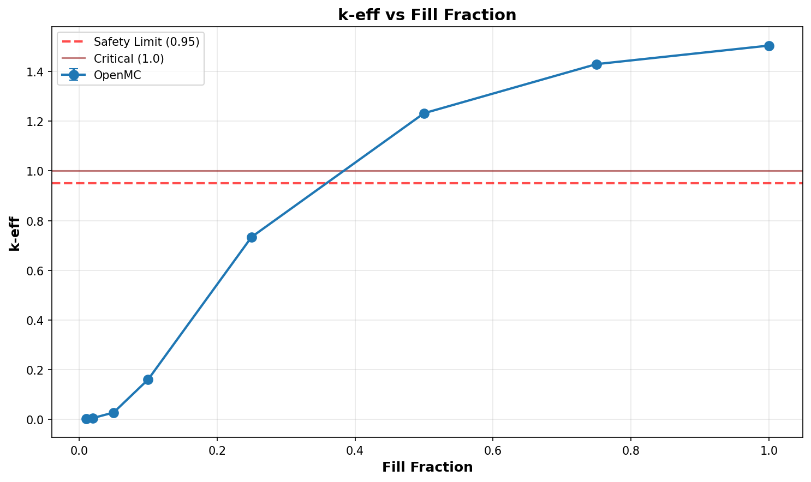

# Criticality Analysis Report

**Experiment:** Pipe Array - UO2F2 Fill Sweep (worst case)
**Generated:** 2026-02-17 17:34:08
**Run Directory:** `/mnt/c/Users/AndyLee/Projects/crit-buddy/experiments/crit_requests/08_pipe_array_3d/runs/uo2f2_fill_sweep/2026-02-17_17-33-13`

---

## Executive Summary

**Result: MIXED SAFETY STATUS**

- SAFE: 5 cases (62.5%)
- MARGINAL: 0 cases (0.0%)
- CRITICAL: 3 cases (37.5%)

| Metric | Value |
|--------|-------|
| Total Cases | 8 |
| k-eff Range | 0.0022 - 1.5048 |
| k-eff Mean | 0.6368 |

---

## Experiment Configuration

**Problem Template:** `parallel_pipes`

### Swept Parameters

| Parameter | Values | Count |
|-----------|--------|-------|
| `fill_fraction` | 0.01, 0.02, 0.05, 0.1, 0.25, 0.5, 0.75, 1.0 | 8 |

### Fixed Parameters

| Parameter | Value |
|-----------|-------|
| `enrichment` | 21 |
| `fissile_density` | 5.09 |
| `fissile_material` | uo2f2 |
| `gap_cm` | 1 |
| `h_to_u` | 25 |
| `length_cm` | 900 |
| `num_pipes` | 2 |
| `pipe_size` | 6 |
| `rows` | 3 |
| `wall_material` | ss304 |
| `water_density` | 0.001 |
| `water_thickness_cm` | 30 |

---

## Results Visualization

### Parameter Sweeps

---

## Detailed Results

Click to expand full results table (8 cases)

| case | keff | std | status | fill_fraction |
| --- | --- | --- | --- | --- |
| case_1 | 1.50482 | 0.00093 | CRITICAL | 1.0 |
| case_2 | 1.43017 | 0.00100 | CRITICAL | 0.75 |
| case_3 | 1.23237 | 0.00099 | CRITICAL | 0.5 |
| case_4 | 0.73389 | 0.00091 | SAFE | 0.25 |
| case_5 | 0.15975 | 0.00048 | SAFE | 0.1 |
| case_6 | 0.02693 | 0.00018 | SAFE | 0.05 |
| case_7 | 0.00462 | 0.00002 | SAFE | 0.02 |
| case_8 | 0.00221 | 0.00001 | SAFE | 0.01 |

---

## Analysis Assumptions

This analysis uses **conservative (bounding)** assumptions:

| Assumption | Value | Conservative? |
|------------|-------|---------------|
| Reflector | unknown | ? |
| Fill Level | 100% | ✓ |

---

## Conclusions

A **safe operating envelope** exists within the analyzed parameter range.

Refer to the heatmap and status plots for specific safe/unsafe boundaries.

---

*Report generated by Crit-Buddy*