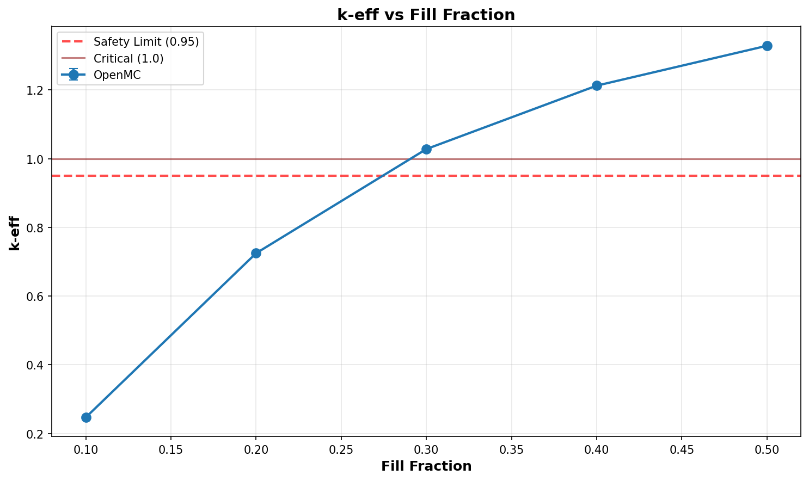

# Criticality Analysis Report

**Experiment:** Pipe Array - UO2F2 Fill Sweep (worst case)
**Generated:** 2026-02-17 18:54:03
**Run Directory:** `/mnt/c/Users/AndyLee/Projects/crit-buddy/experiments/crit_requests/08_pipe_array_3d/runs/uo2f2_fill_sweep/2026-02-17_18-52-43`

---

## Executive Summary

**Result: MIXED SAFETY STATUS**

- SAFE: 2 cases (40.0%)
- MARGINAL: 0 cases (0.0%)
- CRITICAL: 3 cases (60.0%)

| Metric | Value |
|--------|-------|
| Total Cases | 5 |
| k-eff Range | 0.2471 - 1.3285 |
| k-eff Mean | 0.9081 |

---

## Experiment Configuration

**Problem Template:** `parallel_pipes`

### Swept Parameters

| Parameter | Values | Count |
|-----------|--------|-------|
| `fill_fraction` | 0.1, 0.2, 0.3, 0.4, 0.5 | 5 |

### Fixed Parameters

| Parameter | Value |
|-----------|-------|
| `enrichment` | 21 |
| `environment_material` | humid_air |
| `fissile_density` | 5.09 |
| `fissile_material` | uo2f2 |
| `gap_cm` | 1 |
| `h_to_u` | 50 |
| `length_cm` | 900 |
| `num_pipes` | 2 |
| `pipe_size` | 6 |
| `reflector_thickness_cm` | 30 |
| `rows` | 3 |
| `wall_material` | ss304 |

---

## Results Visualization

### Parameter Sweeps

---

## Detailed Results

Click to expand full results table (5 cases)

| case | keff | std | status | fill_fraction |
| --- | --- | --- | --- | --- |
| case_1 | 1.32849 | 0.00105 | CRITICAL | 0.5 |
| case_2 | 1.21242 | 0.00095 | CRITICAL | 0.4 |
| case_3 | 1.02789 | 0.00104 | CRITICAL | 0.3 |
| case_4 | 0.72475 | 0.00097 | SAFE | 0.2 |
| case_5 | 0.24709 | 0.00062 | SAFE | 0.1 |

---

## Analysis Assumptions

This analysis uses **conservative (bounding)** assumptions:

| Assumption | Value | Conservative? |
|------------|-------|---------------|
| Reflector | unknown | ? |
| Fill Level | 100% | ✓ |

---

## Conclusions

A **safe operating envelope** exists within the analyzed parameter range.

Refer to the heatmap and status plots for specific safe/unsafe boundaries.

---

*Report generated by Crit-Buddy*