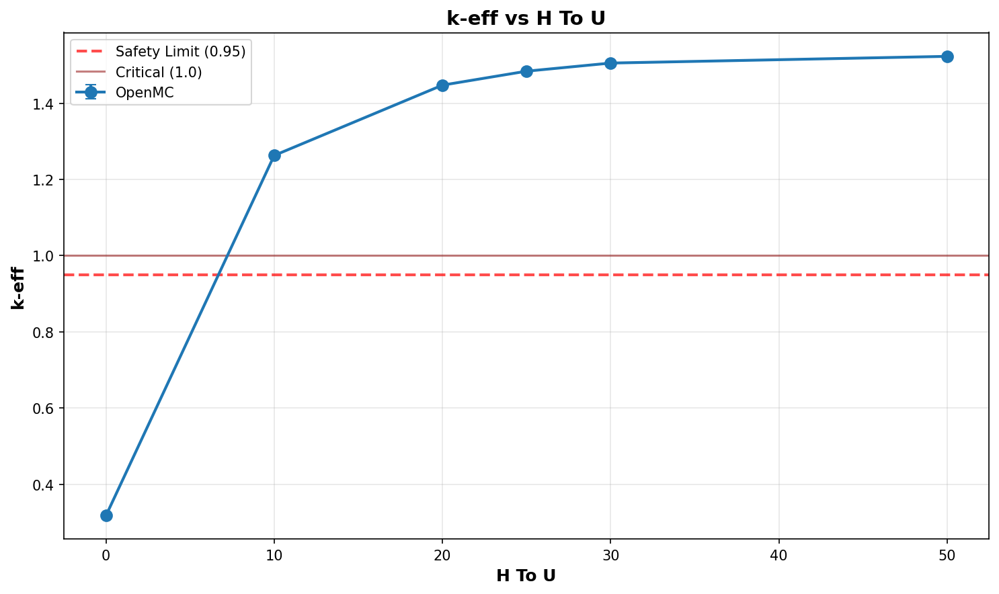

# Criticality Analysis Report

**Experiment:** Pipe Array - UO2F2 H/U Sweep
**Generated:** 2026-02-17 18:51:51
**Run Directory:** `/mnt/c/Users/AndyLee/Projects/crit-buddy/experiments/crit_requests/08_pipe_array_3d/runs/uo2f2_hu_sweep/2026-02-17_18-50-24`

---

## Executive Summary

**Result: MIXED SAFETY STATUS**

- SAFE: 1 cases (16.7%)
- MARGINAL: 0 cases (0.0%)
- CRITICAL: 5 cases (83.3%)

| Metric | Value |
|--------|-------|
| Total Cases | 6 |
| k-eff Range | 0.3174 - 1.5229 |
| k-eff Mean | 1.2566 |

---

## Experiment Configuration

**Problem Template:** `parallel_pipes`

### Swept Parameters

| Parameter | Values | Count |
|-----------|--------|-------|
| `h_to_u` | 0, 10, 20, 25, 30, 50 | 6 |

### Fixed Parameters

| Parameter | Value |
|-----------|-------|
| `enrichment` | 21 |
| `environment_material` | humid_air |
| `fill_fraction` | 1.0 |
| `fissile_density` | 5.09 |
| `fissile_material` | uo2f2 |
| `gap_cm` | 2 |
| `length_cm` | 900 |
| `num_pipes` | 2 |
| `pipe_size` | 6 |
| `reflector_thickness_cm` | 30 |
| `rows` | 3 |
| `wall_material` | ss304 |

---

## Results Visualization

### Parameter Sweeps

---

## Detailed Results

Click to expand full results table (6 cases)

| case | keff | std | status | h_to_u |
| --- | --- | --- | --- | --- |
| case_1 | 0.31742 | 0.00037 | SAFE | 0 |
| case_2 | 1.26278 | 0.00103 | CRITICAL | 10 |
| case_3 | 1.44730 | 0.00093 | CRITICAL | 20 |
| case_4 | 1.48398 | 0.00097 | CRITICAL | 25 |
| case_5 | 1.50529 | 0.00096 | CRITICAL | 30 |
| case_6 | 1.52292 | 0.00097 | CRITICAL | 50 |

---

## Analysis Assumptions

This analysis uses **conservative (bounding)** assumptions:

| Assumption | Value | Conservative? |
|------------|-------|---------------|
| Reflector | unknown | ? |
| Fill Level | 100% | ✓ |

---

## Conclusions

A **safe operating envelope** exists within the analyzed parameter range.

Refer to the heatmap and status plots for specific safe/unsafe boundaries.

---

*Report generated by Crit-Buddy*