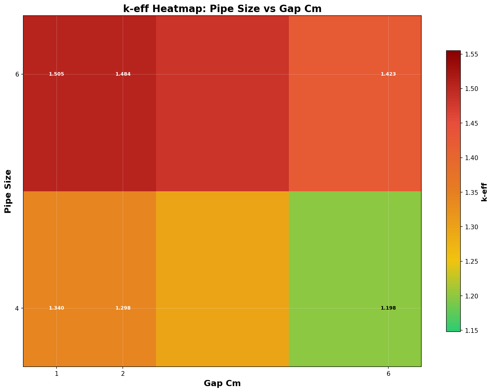
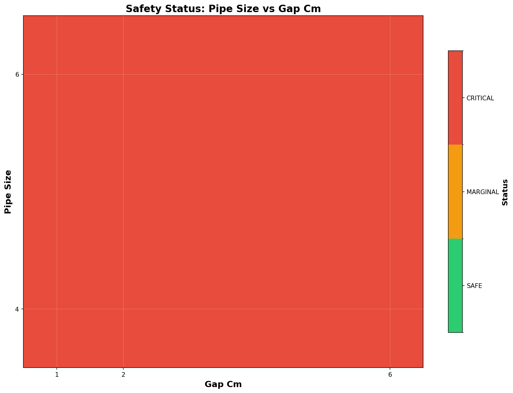
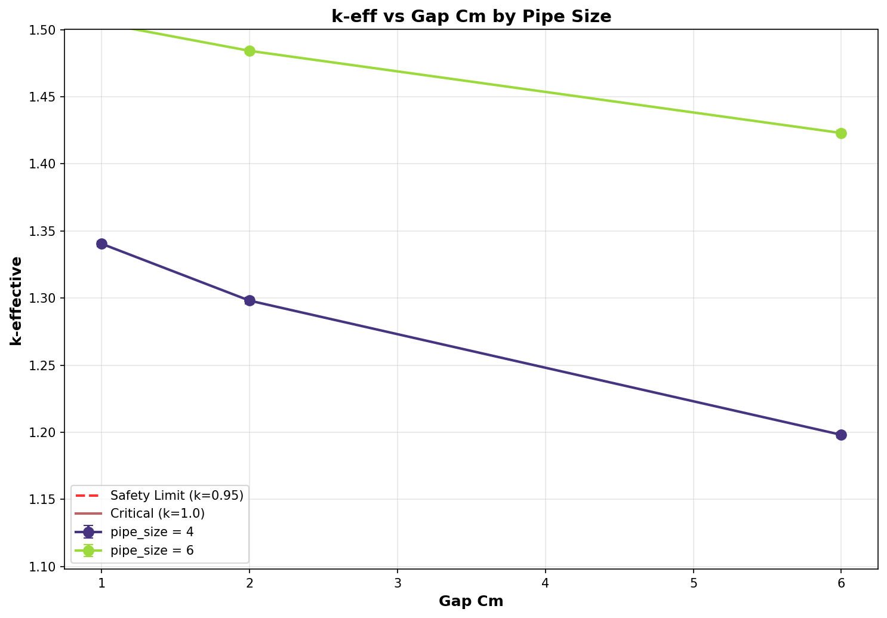
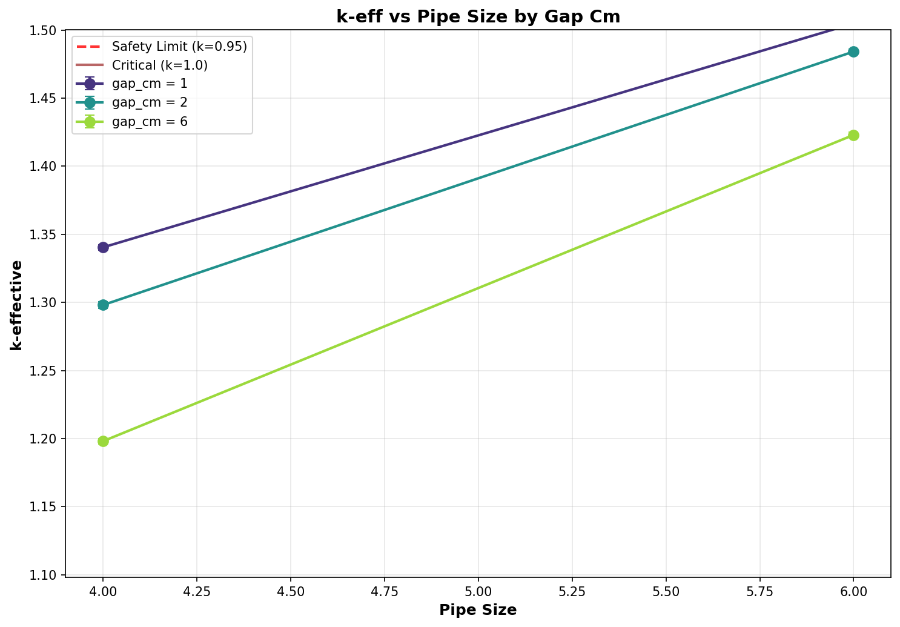

# Criticality Analysis Report

**Experiment:** Pipe Array - UO2F2 Wet (peak H/U)
**Generated:** 2026-02-17 17:20:40
**Run Directory:** `/mnt/c/Users/AndyLee/Projects/crit-buddy/experiments/crit_requests/08_pipe_array_3d/runs/uo2f2_wet/2026-02-17_17-19-41`

---

## Executive Summary

**Result: ALL CASES CRITICAL**

All 6 cases exceeded criticality (k-eff + 2σ ≥ 1.0). 
No safe geometry exists within the analyzed parameter range under these conditions.

| Metric | Value |
|--------|-------|
| Total Cases | 6 |
| k-eff Range | 1.1982 - 1.5048 |
| k-eff Mean | 1.3748 |

---

## Experiment Configuration

**Problem Template:** `parallel_pipes`

### Swept Parameters

| Parameter | Values | Count |
|-----------|--------|-------|
| `gap_cm` | 1, 2, 6 | 3 |
| `pipe_size` | 4, 6 | 2 |

### Fixed Parameters

| Parameter | Value |
|-----------|-------|
| `enrichment` | 21 |
| `fissile_density` | 5.09 |
| `fissile_material` | uo2f2 |
| `h_to_u` | 25 |
| `length_cm` | 900 |
| `num_pipes` | 2 |
| `rows` | 3 |
| `wall_material` | ss304 |
| `water_density` | 0.001 |
| `water_thickness_cm` | 30 |

---

## Results Visualization

### k-eff Heatmap

### Safety Status Map

### Parameter Sweeps

---

## Detailed Results

Click to expand full results table (6 cases)

| case | keff | std | status | gap_cm | pipe_size |
| --- | --- | --- | --- | --- | --- |
| case_1 | 1.34045 | 0.00104 | CRITICAL | 1 | 4 |
| case_2 | 1.29811 | 0.00115 | CRITICAL | 2 | 4 |
| case_3 | 1.19815 | 0.00099 | CRITICAL | 6 | 4 |
| case_4 | 1.50482 | 0.00093 | CRITICAL | 1 | 6 |
| case_5 | 1.48415 | 0.00102 | CRITICAL | 2 | 6 |
| case_6 | 1.42295 | 0.00100 | CRITICAL | 6 | 6 |

---

## Analysis Assumptions

This analysis uses **conservative (bounding)** assumptions:

| Assumption | Value | Conservative? |
|------------|-------|---------------|
| Reflector | unknown | ? |
| Fill Level | 100% | ✓ |

---

## Conclusions

At the analyzed conditions, **no safe geometry exists** within the parameter range:

- gap_cm: 1 - 6
- pipe_size: 4 - 6

**Recommendations:**
- Consider lower enrichment levels
- Use favorable geometry (pipes instead of open vessels)
- Implement administrative controls (mass limits)

---

*Report generated by Crit-Buddy*