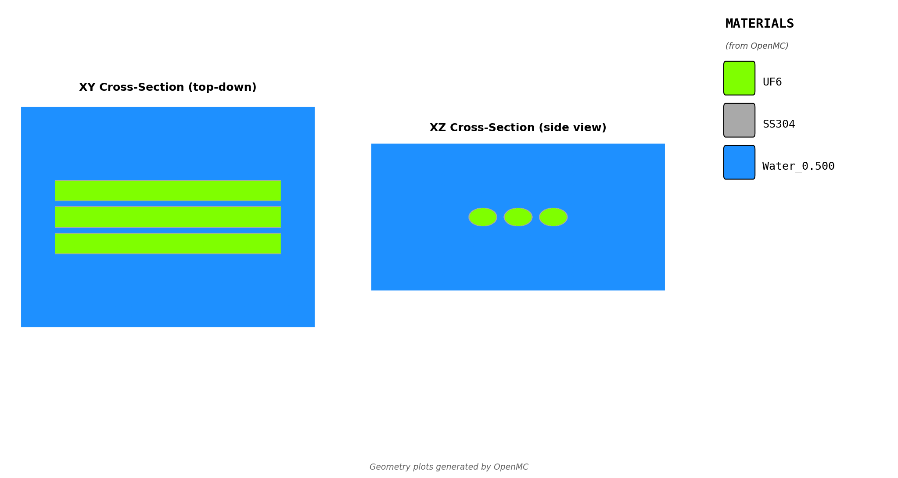
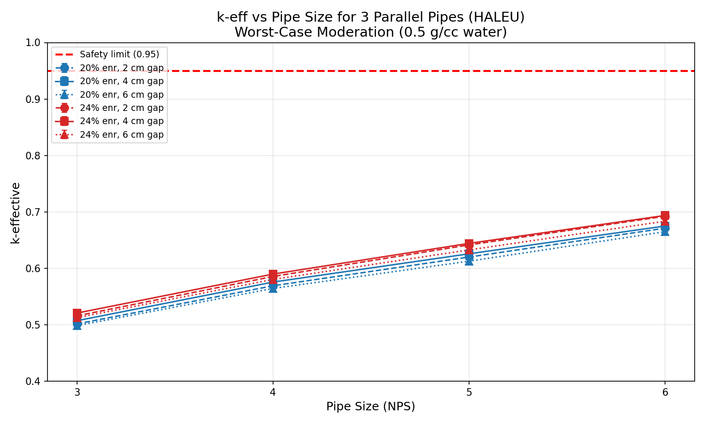
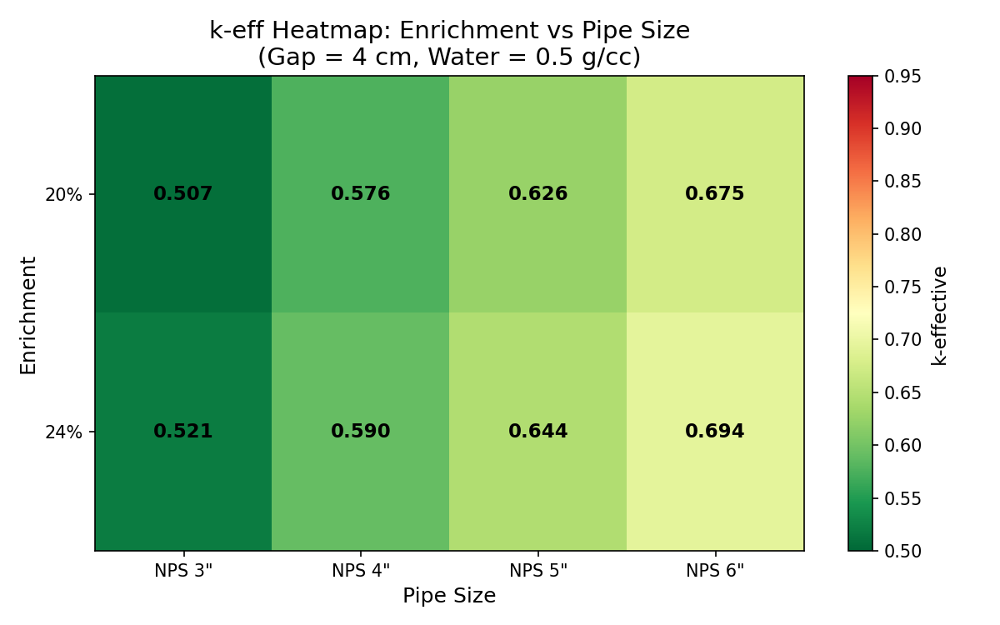

# Criticality Safety Analysis
## HALEU Parallel Pipes Configuration

**Calculation Number:** [To Be Assigned]
**Revision:** 0
**Date:** 2026-02-09

| Role | Name | Date |
|------|------|------|
| Prepared by | | |
| Reviewed by | | |
| Approved by | | |

---

## 1. References

1. ANSI/ANS-8.1-2014, "Nuclear Criticality Safety in Operations with Fissionable Materials Outside Reactors"
2. 10 CFR 70.24, "Criticality Accident Requirements"
3. NUREG/CR-6698, "Guide for Validation of Nuclear Criticality Safety Calculational Methodology"
4. OpenMC Monte Carlo Code (open-source particle transport)
5. ENDF/B-VIII.0 Nuclear Data Library

---

## 2. Purpose

This analysis determines the criticality safety of parallel cascade piping configurations containing high-assay low-enriched uranium (HALEU) in the form of solid UF6. The study evaluates a configuration of three parallel horizontal pipes arranged in a row, as would be found in cascade header piping or process manifolds.

The analysis addresses the following criticality safety questions:

1. What is the maximum reactivity for 3 parallel pipes at HALEU enrichments (20-24%)?
2. How does pipe diameter (NPS 3" to 6") affect criticality safety?
3. What pipe spacing (edge-to-edge gap) is required for adequate subcriticality?

This parametric study sweeps enrichment levels from 20% to 24% (HALEU range), pipe sizes from NPS 3" to NPS 6", and gap distances from 2 cm to 6 cm to map the safety envelope for these configurations.

---

## 3. Inputs

### 3.1 Geometry Visualization

*Figure: XY cross-section showing three parallel pipes with UF6 (yellow), stainless steel walls (gray), and water moderator/reflector (blue).*

### 3.2 Pipe Configuration

| Parameter | Value | Units |
|-----------|-------|-------|
| Number of pipes | 3 | - |
| Pipe arrangement | Horizontal, parallel | - |
| Pipe orientation | Horizontal (along X-axis) | - |
| Pipe length | 200 | cm |

### 3.3 Pipe Geometry (per NPS)

Standard schedule 40 pipe dimensions:

| NPS | Outer Diameter | Wall Thickness | Inner Diameter |
|-----|----------------|----------------|----------------|
| 3" | 8.89 cm | 0.549 cm | 7.79 cm |
| 4" | 11.43 cm | 0.602 cm | 10.23 cm |
| 5" | 14.13 cm | 0.655 cm | 12.82 cm |
| 6" | 16.83 cm | 0.711 cm | 15.41 cm |

### 3.4 Materials

| Material | Composition | Density (g/cc) |
|----------|-------------|----------------|
| UF6 | Solid uranium hexafluoride | 5.09 |
| Pipe wall | Stainless steel 304 | 8.0 |
| Moderator/Reflector | Water | 0.5 (worst-case) |

*Note: Water at 0.5 g/cc represents worst-case moderation conditions (mist, fog, or partial flooding). This density produces peak reactivity for multi-unit arrays.*

### 3.5 Parameter Ranges Analyzed

| Parameter | Values | Units |
|-----------|--------|-------|
| Enrichment | 20, 24 | wt% U-235 |
| Pipe size (NPS) | 3, 4, 5, 6 | inches |
| Edge-to-edge gap | 2, 4, 6 | cm |
| Water density | 0.5 | g/cc |
| Water reflector thickness | 30 | cm |

**Total cases analyzed:** 2 enrichments × 4 pipe sizes × 3 gaps = 24 cases

---

## 4. Assumptions

### 4.1 Worst-Case Moderation

For multi-unit configurations, the most reactive water density is NOT fully flooded (1.0 g/cc). Instead, intermediate densities (~0.5 g/cc) can produce higher k-eff values due to the balance between:

- **Moderation benefit**: Water thermalizes neutrons, increasing fission probability
- **Absorption penalty**: More water = more neutron absorption between units

A preliminary moderation sweep identified ~0.5 g/cc as peak reactivity, representing conditions such as:

- Water mist/fog accumulation
- Partial flooding scenarios
- Fire suppression spray conditions

### 4.2 Conservative Assumptions Summary

| Assumption | Value Used | Justification |
|------------|------------|---------------|
| UF6 form | Pure solid | Bounds actual chemistry (complexes reduce reactivity) |
| UF6 density | 5.09 g/cc | Maximum solid density |
| Fill level | 100% | Assumes fully loaded pipes |
| Temperature | Room temperature | Most reactive condition |
| Enrichment | Up to 24% | Bounds HALEU operations |
| Water density | 0.5 g/cc | Peak reactivity from moderation sweep |
| Reflection | 30 cm water | Full reflection on all sides |
| Pipe wall | SS304 | Realistic for process piping |

---

## 5. Analytical Methods and Computations

### 5.1 Monte Carlo Code

- **Code**: OpenMC (open-source Monte Carlo particle transport)
- **Nuclear data**: ENDF/B-VIII.0 continuous-energy cross sections
- **Thermal scattering**: S(α,β) treatment for hydrogen in water

### 5.2 Simulation Parameters

| Parameter | Value |
|-----------|-------|
| Particles per batch | 10,000 |
| Total batches | 150 |
| Inactive batches | 50 |
| Active batches | 100 |
| Total histories | 1,000,000 |

### 5.3 Geometry Model

- **3D explicit geometry**: Three horizontal cylinders modeled individually
- **Pipe components**: UF6 core, stainless steel wall
- **Water**: Surrounds all pipes and fills gaps between them
- **Boundary conditions**: Vacuum at outer boundaries

### 5.4 Statistical Uncertainty

- Expected 1σ uncertainty: ~80-100 pcm
- **Safety margin**: k-eff + 2σ used for all safety determinations
- Status classification:
  - SAFE: k-eff + 2σ < 0.95
  - MARGINAL: 0.95 ≤ k-eff + 2σ < 1.0
  - CRITICAL: k-eff + 2σ ≥ 1.0

---

## 6. Results

### 6.1 Summary Statistics

| Metric | Value |
|--------|-------|
| Total cases analyzed | 24 |
| Cases SAFE | 24 |
| Cases MARGINAL | 0 |
| Cases CRITICAL | 0 |
| k-eff range | 0.4985 - 0.6936 |

### 6.2 k-effective Results

**k-eff by Enrichment and Pipe Size (Gap = 2 cm)**

| Enrichment | NPS 3" | NPS 4" | NPS 5" | NPS 6" |
|------------|--------|--------|--------|--------|
| 20% | 0.5015 | 0.5690 | 0.6200 | 0.6711 |
| 24% | 0.5158 | 0.5855 | 0.6415 | 0.6922 |

**k-eff by Enrichment and Pipe Size (Gap = 4 cm)**

| Enrichment | NPS 3" | NPS 4" | NPS 5" | NPS 6" |
|------------|--------|--------|--------|--------|
| 20% | 0.5072 | 0.5756 | 0.6257 | 0.6750 |
| 24% | 0.5207 | 0.5898 | 0.6442 | 0.6936 |

**k-eff by Enrichment and Pipe Size (Gap = 6 cm)**

| Enrichment | NPS 3" | NPS 4" | NPS 5" | NPS 6" |
|------------|--------|--------|--------|--------|
| 20% | 0.4985 | 0.5643 | 0.6127 | 0.6649 |
| 24% | 0.5126 | 0.5803 | 0.6326 | 0.6834 |

### 6.3 Effect of Pipe Size

Larger pipe sizes result in higher k-effective values due to increased fissile mass:

- At 20% enrichment: NPS 3" to NPS 6" increases k-eff by Δk = 0.168
- At 24% enrichment: NPS 3" to NPS 6" increases k-eff by Δk = 0.173

### 6.4 Effect of Gap Distance

The effect of edge-to-edge gap on k-effective is minimal for these configurations:

- At 20% enrichment, NPS 6": Gap 2 cm to 6 cm changes k-eff by Δk = -0.0062
- At 24% enrichment, NPS 6": Gap 2 cm to 6 cm changes k-eff by Δk = -0.0088

The negligible gap sensitivity indicates that pipe spacing has minimal impact on criticality for these far-subcritical configurations.

### 6.5 Visualization

---

## 7. Conclusions

### 7.1 Safety Status

**All 24 analyzed cases are SAFE (k-eff + 2σ < 0.95).**

The maximum k-effective observed was **0.694** (at 24% enrichment, NPS 6", 4 cm gap), which provides a substantial safety margin below the 0.95 acceptance criterion.

### 7.2 Maximum k-eff by Configuration

| Enrichment | Pipe Size | Max k-eff | Safety Margin to 0.95 |
|------------|-----------|-----------|----------------------|
| 20% | NPS 6" | 0.6750 | 0.2750 |
| 24% | NPS 6" | 0.6936 | 0.2564 |

### 7.3 Key Findings

1. **Three parallel pipes are inherently safe** for HALEU enrichments up to 24% in pipes up to NPS 6", even at worst-case moderation conditions.

2. **No spacing restrictions required**: All analyzed gap distances (2-6 cm) are safe. Even touching pipes (gap = 0) would likely remain subcritical given the large safety margins observed.

3. **Pipe diameter is the dominant parameter**: Increasing pipe size from NPS 3" to NPS 6" increases k-eff by approximately 0.17, compared to negligible (<0.01) changes from gap distance.

4. **Conservative bounding analysis**: These results use worst-case moderation (0.5 g/cc water) and maximum solid UF6 density (5.09 g/cc). Actual operating conditions would produce lower reactivity.

### 7.4 Operational Recommendations

Based on this analysis, the following operational guidance is provided:

- **No minimum spacing required** between parallel pipes up to NPS 6" at enrichments up to 24%
- **No administrative controls needed** for 3-pipe configurations in this size range
- **Standard pipe installation practices** are acceptable from a criticality safety standpoint

---

## 8. Attachments

1. **Attachment A**: Geometry validation plots (XY, XZ cross-sections)
2. **Attachment B**: Full results CSV file
3. **Attachment C**: Input YAML configuration file
4. **Attachment D**: OpenMC input files (sample case)

---

*Report generated by Crit-Buddy*