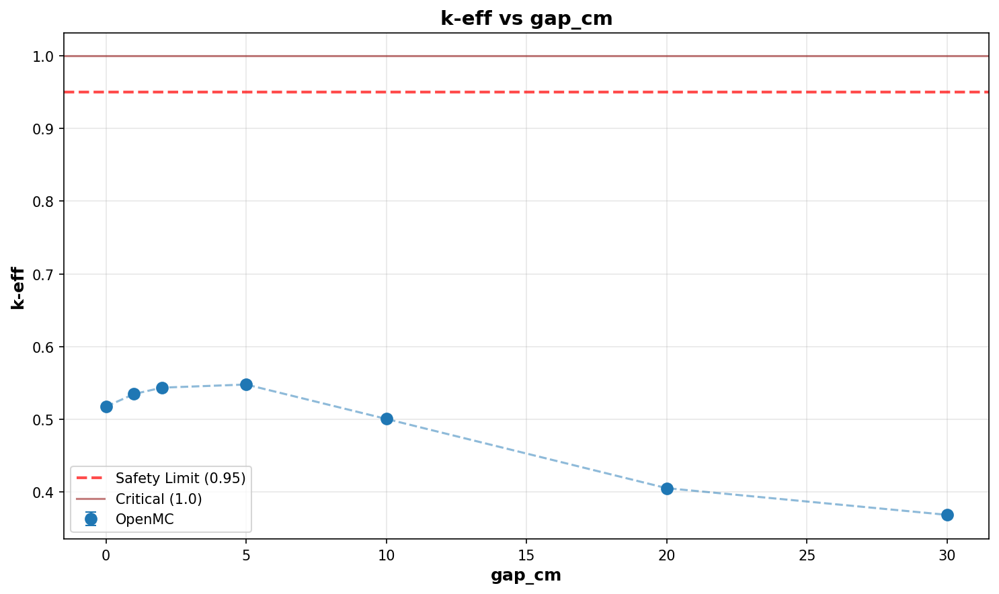

# Criticality Analysis Report

**Experiment:** Parallel Pipes (3x) - 15% Enrichment
**Generated:** 2026-02-07 00:14:52
**Run Directory:** `/mnt/c/Users/AndyLee/Projects/crit-buddy/experiments/crit_requests/03_parallel_pipes/enr_15/runs/gap_sweep/2026-02-06_23-52-18`

---

## Executive Summary

**Result: ALL CASES SAFE**

All 7 cases are subcritical (k-eff + 2σ < 0.95).

| Metric | Value |
|--------|-------|
| Total Cases | 7 |
| k-eff Range | 0.3687 - 0.5479 |
| k-eff Mean | 0.4883 |

---

## Experiment Configuration

**Problem Template:** `parallel_pipes`

### Swept Parameters

| Parameter | Values | Count |
|-----------|--------|-------|
| `gap_cm` | 0, 1, 2, 5, 10, 20, 30 | 7 |

### Fixed Parameters

| Parameter | Value |
|-----------|-------|
| `enrichment` | 15 |
| `length_cm` | 200 |
| `num_pipes` | 3 |
| `pipe_size` | 4 |
| `uf6_density` | 5.09 |
| `wall_material` | ss304 |
| `water_density` | 0.5 |
| `water_thickness_cm` | 30 |

---

## Results Visualization

### Parameter Sweeps

---

## Detailed Results

Click to expand full results table (7 cases)

| case | keff | std | status | gap_cm |
| --- | --- | --- | --- | --- |
| case_1 | 0.51745 | 0.00075 | SAFE | 0 |
| case_2 | 0.53483 | 0.00086 | SAFE | 1 |
| case_3 | 0.54357 | 0.00091 | SAFE | 2 |
| case_4 | 0.54788 | 0.00097 | SAFE | 5 |
| case_5 | 0.50056 | 0.00087 | SAFE | 10 |
| case_6 | 0.40538 | 0.00072 | SAFE | 20 |
| case_7 | 0.36870 | 0.00074 | SAFE | 30 |

---

## Analysis Assumptions

This analysis uses **conservative (bounding)** assumptions:

| Assumption | Value | Conservative? |
|------------|-------|---------------|
| Reflector | unknown | ? |
| Fill Level | 100% | ✓ |

---

## Conclusions

All analyzed geometries are **subcritical** under conservative assumptions.

The analyzed equipment can be operated safely within the parameter ranges.

---

*Report generated by Crit-Buddy*