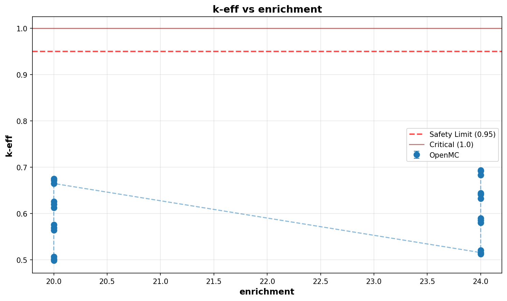
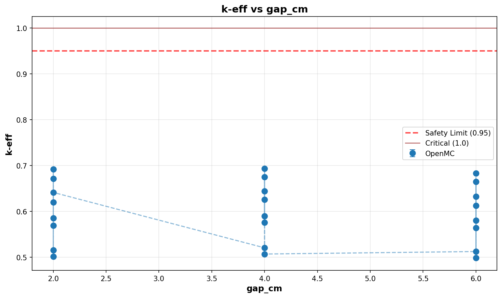
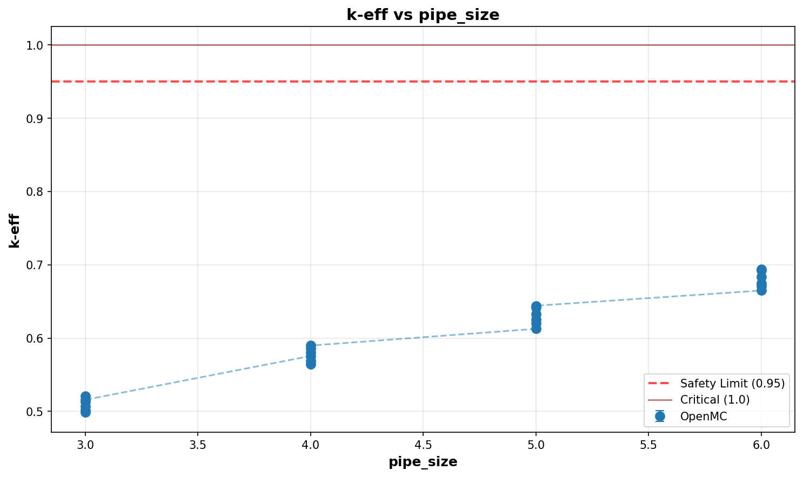

# Criticality Analysis Report

**Experiment:** Parallel Pipes (3x) - HALEU NPS/Gap Sweep
**Generated:** 2026-02-09 16:25:58
**Run Directory:** `/mnt/c/Users/AndyLee/Projects/crit-buddy/experiments/crit_requests/03_parallel_pipes/runs/haleu_nps_gap_sweep/2026-02-09_16-14-43`

---

## Executive Summary

**Result: ALL CASES SAFE**

All 24 cases are subcritical (k-eff + 2σ < 0.95).

| Metric | Value |
|--------|-------|
| Total Cases | 24 |
| k-eff Range | 0.4985 - 0.6936 |
| k-eff Mean | 0.5991 |

---

## Experiment Configuration

**Problem Template:** `parallel_pipes`

### Swept Parameters

| Parameter | Values | Count |
|-----------|--------|-------|
| `enrichment` | 20, 24 | 2 |
| `gap_cm` | 2, 4, 6 | 3 |
| `pipe_size` | 3, 4, 5, 6 | 4 |

### Fixed Parameters

| Parameter | Value |
|-----------|-------|
| `length_cm` | 200 |
| `num_pipes` | 3 |
| `uf6_density` | 5.09 |
| `wall_material` | ss304 |
| `water_density` | 0.5 |
| `water_thickness_cm` | 30 |

---

## Results Visualization

### Parameter Sweeps

---

## Detailed Results

Click to expand full results table (24 cases)

| case | keff | std | status | enrichment | gap_cm | pipe_size |
| --- | --- | --- | --- | --- | --- | --- |
| case_1 | 0.50147 | 0.00084 | SAFE | 20 | 2 | 3 |
| case_2 | 0.50717 | 0.00082 | SAFE | 20 | 4 | 3 |
| case_3 | 0.49847 | 0.00089 | SAFE | 20 | 6 | 3 |
| case_4 | 0.56904 | 0.00087 | SAFE | 20 | 2 | 4 |
| case_5 | 0.57560 | 0.00085 | SAFE | 20 | 4 | 4 |
| case_6 | 0.56433 | 0.00095 | SAFE | 20 | 6 | 4 |
| case_7 | 0.61995 | 0.00091 | SAFE | 20 | 2 | 5 |
| case_8 | 0.62570 | 0.00092 | SAFE | 20 | 4 | 5 |
| case_9 | 0.61265 | 0.00090 | SAFE | 20 | 6 | 5 |
| case_10 | 0.67110 | 0.00092 | SAFE | 20 | 2 | 6 |
| case_11 | 0.67498 | 0.00090 | SAFE | 20 | 4 | 6 |
| case_12 | 0.66489 | 0.00094 | SAFE | 20 | 6 | 6 |
| case_13 | 0.51581 | 0.00090 | SAFE | 24 | 2 | 3 |
| case_14 | 0.52067 | 0.00086 | SAFE | 24 | 4 | 3 |
| case_15 | 0.51263 | 0.00095 | SAFE | 24 | 6 | 3 |
| case_16 | 0.58554 | 0.00087 | SAFE | 24 | 2 | 4 |
| case_17 | 0.58978 | 0.00089 | SAFE | 24 | 4 | 4 |
| case_18 | 0.58032 | 0.00085 | SAFE | 24 | 6 | 4 |
| case_19 | 0.64148 | 0.00088 | SAFE | 24 | 2 | 5 |
| case_20 | 0.64418 | 0.00092 | SAFE | 24 | 4 | 5 |
| case_21 | 0.63257 | 0.00086 | SAFE | 24 | 6 | 5 |
| case_22 | 0.69224 | 0.00080 | SAFE | 24 | 2 | 6 |
| case_23 | 0.69363 | 0.00099 | SAFE | 24 | 4 | 6 |
| case_24 | 0.68344 | 0.00103 | SAFE | 24 | 6 | 6 |

---

## Analysis Assumptions

This analysis uses **conservative (bounding)** assumptions:

| Assumption | Value | Conservative? |
|------------|-------|---------------|
| Reflector | unknown | ? |
| Fill Level | 100% | ✓ |

---

## Conclusions

All analyzed geometries are **subcritical** under conservative assumptions.

The analyzed equipment can be operated safely within the parameter ranges.

---

*Report generated by Crit-Buddy*