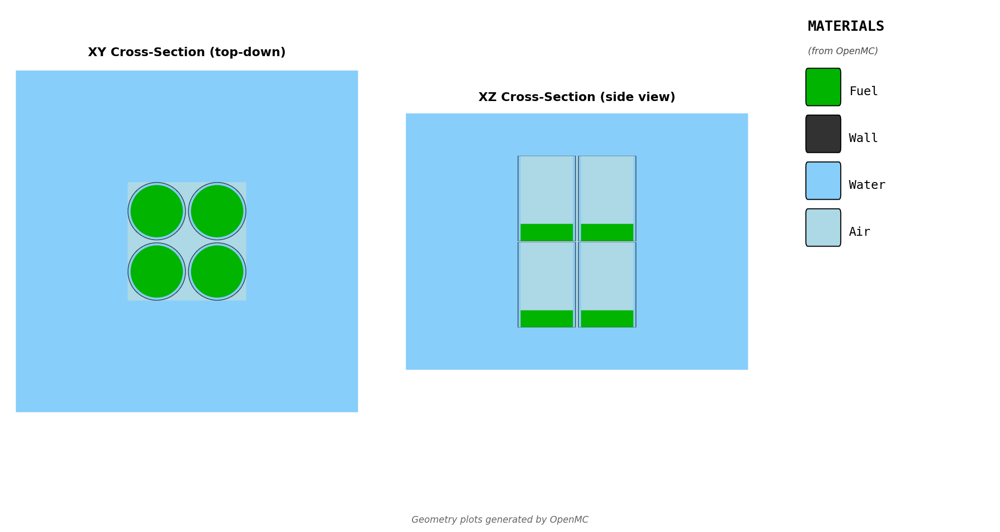

# Cylinder Array Handoff

## Purpose

This document is the reviewer-facing handoff for the maintained
`cylinder-array` model used in crit-buddy.

Its purpose is to help a criticality safety reviewer understand:

- what physical system the model represents
- what parameters engineers are allowed to change
- what assumptions are fixed in the current implementation
- how fissile material density is handled
- how the model is run and validated in OpenMC
- what engineering work has already been completed with it
- what the current certification gap is

This handoff supports engineering review and traceability. It is not the final
licensed MCNP deliverable.

## Model Overview

The `cylinder-array` model represents a finite array of closed
centrifuge-style cylinders. Each repeated unit reuses the maintained vessel
construction from the `centrifuge-unit-cell` model family:

- fissile material fills the inner cylinder up to the specified fill height
- air headspace occupies the remaining internal height above the fill
- a water annulus surrounds the fissile region
- a steel wall and steel end caps close the vessel
- local air fills the remainder of each lattice pitch cell
- an external water shell surrounds the finite array before the model boundary

The model supports both:

- `UO2F2` with density derived from `h_to_u` unless explicitly overridden
- `UF6` with engineer-specified density

User-facing axes are:

- `x`: horizontal
- `y`: vertical
- `z`: depth

Internally, the OpenMC implementation keeps the cylinder axis aligned to the
OpenMC `z` axis and remaps user `y` and `z` accordingly.

The model is intended for finite arrangement studies where engineers need to
vary:

- cylinder counts
- uniform wall-to-wall spacing
- vessel geometry
- fissile material state
- external moderation thickness
- outer boundary conditions

## Visualization

Preview regenerated on `2026-04-05` from
`models/cylinder-array/openmc/visualization_config.yaml` using `--validate`.

## Configurable Parameters

All parameters below are user-configurable through the standard model YAML
interface.

| Parameter | Meaning | Units | Template default | Typical use | Current notes |
| --- | --- | --- | --- | --- | --- |
| `fissile_material` | Filled-region fissile material | - | `uo2f2` | Switch between `UO2F2` and `UF6` studies | `UF6` is typically used for dry screening; `UO2F2` for wet/moderated cases |
| `enrichment_pct` | U-235 weight percent | `%` | `20.2` | Fissile sensitivity studies | `CB-17` used `21.0` |
| `fissile_density_g_cm3` | Optional explicit fissile density override | `g/cm3` | unset | `UF6` studies or explicit replay cases | For `UO2F2`, leave unset and derive from `h_to_u` unless replaying a frozen basis |
| `h_to_u` | Hydrogen-to-uranium atomic ratio for `UO2F2` | - | `5.0` | Moderation sensitivity studies | Shared ORNL-based density path |
| `inner_radius_cm` | Inner vessel radius / fuel radius | `cm` | `11.70` | Vessel geometry studies | `CB-17` used `38.1` |
| `water_film_thickness_cm` | Water annulus thickness outside the fissile region | `cm` | `1.0` | Moderator thickness studies | Also reused in large-cylinder request work |
| `wall_thickness_cm` | Steel wall thickness and end-cap thickness | `cm` | `0.3175` | Vessel construction studies | `CB-17` used `1.27` |
| `vessel_height_cm` | Inner vessel height excluding end caps | `cm` | `100.0` | Geometry studies | `CB-17` used `207.01` |
| `fill_height_cm` | Fissile fill height from the vessel bottom | `cm` | `20.0` | Direct fill-height studies | Overridden when `fill_fraction_percent` is given |
| `fill_fraction_percent` | Fill as a percent of vessel height | `%` | unset | Request workflows and fill threshold sweeps | Preferred for operational screening requests |
| `num_cylinders_x` | Number of cylinders in horizontal direction | - | `1` | Finite array sizing | |
| `num_cylinders_y` | Number of cylinders in vertical direction | - | `1` | Finite array stacking | User vertical maps to OpenMC axial direction |
| `num_cylinders_z` | Number of cylinders in depth direction | - | `1` | Finite array sizing | |
| `wall_to_wall_gap_cm` | Uniform wall-to-wall and cap-to-cap gap | `cm` | `1.0` | Array spacing studies | Same gap is used in all three directions |
| `edge_moderator_thickness_cm` | External water shell thickness | `cm` | `50.0` | Leakage and moderation studies | Set to `50 cm` in current defaults and request work |
| `x_boundary_type` | Boundary at `x` min / max | - | `vacuum` | Finite leakage or bounding studies | |
| `y_boundary_type` | Boundary at `y` min / max | - | `vacuum` | Vertical leakage or bounding studies | User vertical axis |
| `z_boundary_type` | Boundary at `z` min / max | - | `vacuum` | Depth leakage or bounding studies | User depth axis |

## Modeling Assumptions

- The array is assembled from identical closed cylinders with one reusable
  lattice universe.
- The same `wall_to_wall_gap_cm` is used for side-to-side spacing and for the
  top/bottom cap-to-cap spacing in the vertical direction.
- End-cap thickness is tied directly to `wall_thickness_cm`.
- The external moderator is modeled as a uniform water shell of thickness
  `edge_moderator_thickness_cm`.
- Default boundaries are vacuum in `x`, `y`, and `z`, so the default model is
  a finite leaking array rather than a reflected lattice.
- Internal OpenMC axis mapping is intentionally different from the user-facing
  input axes; the handoff and review work should always treat user `y` as the
  physical vertical direction.
- The model is a static eigenvalue transport model with no depletion, thermal
  feedback, or absorber credit.
- The default `UO2F2` path uses the shared ORNL/TM-12292 density basis through
  `critbuddy/core/materials/uo2f2_physics.py`.

## Material Definitions

The model uses shared materials and shared fissile-material construction from
`critbuddy/core/materials/`.

Static shared materials:

- `stainless_steel_316` for the vessel wall and end caps
- `water` for the water annulus and outer moderator shell
- `centrifuge_air` for the headspace and local lattice air

Generated fissile material:

- `create_fissile_material(...)` builds either `UO2F2` or `UF6`

Current fissile-material behavior:

- `UF6` uses `fissile_density_g_cm3` directly
- `UO2F2` uses `enrichment_pct` and `h_to_u`
- if `fissile_density_g_cm3` is unset for `UO2F2`, the shared ORNL-based
  density helper is used automatically

Current material references for this model:

- `critbuddy/core/materials/builders.py`
- `critbuddy/core/materials/material_specs.py`
- `critbuddy/core/materials/uo2f2_physics.py`
- `docs/references/materials/README.md`
- `docs/references/materials/uo2f2-density-basis.md`

## Solver / Analysis Setup

The OpenMC implementation lives in `openmc/model.py` under this model folder.

Current default solver setup:

- run mode: eigenvalue
- particles per batch: `4800`
- total batches: `200`
- inactive batches: `50`
- source: a distributed box spanning the filled portions of the finite array

For each case, crit-buddy can preserve:

- `materials.xml`
- `geometry.xml`
- `settings.xml`
- `results.csv`
- `REPORT.md`
- summary plots

The current visualization basis is driven from:

- `models/cylinder-array/openmc/visualization_config.yaml`

## Validation and Certification Status

Current validation evidence:

- integration test suite:
  `tests/integration/models/test_cylinder_array.py`
- geometry preview:
  `models/cylinder-array/openmc/_validation/geometry.png`
- production engineering use:
  `requests/CB-17/results/REPORT.md`

Validation performed on `2026-04-05`:

- `python -m unittest tests.integration.models.test_cylinder_array`
- `python run_study.py models/cylinder-array/openmc/visualization_config.yaml --validate`

Current certification status:

- There is **no frozen OpenMC/MCNP parity checkpoint yet** under
  `certifications/cylinder-array/`.
- The model inherits vessel geometry intent and much of its material basis from
  the maintained `centrifuge-unit-cell` family, but the finite-array assembly
  itself has not yet been preserved in a solver-to-solver certification
  package.
- The absence of a frozen `cylinder-array` certification should be treated as a
  known review gap. Current model confidence rests on construction tests,
  geometry validation, and completed engineering use, not on a blessed parity
  sweep.

## Engineering Use of the Model

To date, the clearest published use of this model is the `CB-17` 30B cylinder
array workflow under `requests/CB-17/`.

That request used:

- model: `cylinder-array`
- enrichment: `21.0 wt%`
- geometry: `6 x 1 x 1` finite array
- inner radius: `38.1 cm`
- wall thickness: `1.27 cm`
- vessel height: `207.01 cm`
- wall-to-wall gap: `30.48 cm`
- edge moderator thickness: `50.0 cm`
- boundaries: vacuum in `x`, `y`, and `z`

The executed three-step workflow was:

1. Dry `UF6` fill screening
2. Wet `UO2F2` `H/U` optimization
3. Wet bottom-fill threshold sweep

Key `CB-17` outcomes:

| Step | Controlling result |
| --- | --- |
| Dry `UF6` screening | highest sampled `k+2sigma` at `fill_fraction_percent = 100.0` |
| `UO2F2` moderation sweep | peak sampled `k+2sigma` at `h_to_u = 30.0` |
| Wet bottom-fill sweep | limit crossing bracketed between `5.0%` and `10.0%` fill |
| Single-cylinder dry allowable fill | `49.7256%`, `102.9369 cm`, `469.43 L`, `2389.40 kg UF6` |
| Single-cylinder wet allowable fill | `5.1767%`, `10.7162 cm`, `48.87 L`, `91.94 kg` wet solution |

Important interpretation:

- These are request-specific engineering results for one large 30B-like
  geometry.
- They should not be treated as a generic benchmark for all uses of the model.
- They do show that the model has been exercised successfully in a realistic
  finite-array operational workflow.

## Current Lookup Data

The `CB-17` workflow provides the current published sensitivity data for this
model family.

### Dry UF6 fill screening (`CB-17`)

| Fill fraction (%) | `k-eff` | `std` | `k+2sigma` | Status |
| ---: | ---: | ---: | ---: | --- |
| 10.0 | 0.58157 | 0.00090 | 0.58338 | SAFE |
| 20.0 | 0.77250 | 0.00102 | 0.77453 | SAFE |
| 50.0 | 0.94974 | 0.00094 | 0.95162 | MARGINAL |
| 75.0 | 0.98958 | 0.00100 | 0.99158 | MARGINAL |
| 100.0 | 1.00717 | 0.00095 | 1.00908 | CRITICAL |

### Wet UO2F2 H/U sweep (`CB-17`)

| `H/U` | `k-eff` | `std` | `k+2sigma` | Status |
| ---: | ---: | ---: | ---: | --- |
| 0.0 | 1.11077 | 0.00108 | 1.11293 | CRITICAL |
| 1.0 | 1.24005 | 0.00105 | 1.24216 | CRITICAL |
| 5.0 | 1.42049 | 0.00113 | 1.42275 | CRITICAL |
| 10.0 | 1.50814 | 0.00107 | 1.51028 | CRITICAL |
| 20.0 | 1.56909 | 0.00099 | 1.57107 | CRITICAL |
| 30.0 | 1.57689 | 0.00098 | 1.57886 | CRITICAL |
| 40.0 | 1.56861 | 0.00100 | 1.57062 | CRITICAL |
| 60.0 | 1.53354 | 0.00100 | 1.53554 | CRITICAL |

Interpretation:

- For the current published request data, larger dry fill increased reactivity
  across the sampled range.
- For the wet `CB-17` basis, reactivity increased strongly with moderation and
  peaked around `H/U = 30`.
- These lookup data are useful for engineering context, but they are not the
  same thing as a frozen model certification.

## Limitations

- No frozen OpenMC/MCNP certification checkpoint exists yet for this model.
- Current published sweep data come from one request geometry and should not be
  treated as universal lookup data for all array sizes and vessel dimensions.
- The current review basis is strongest for model construction and engineering
  workflow execution, not for formal solver-to-solver bias characterization.
- The external moderator shell and outer boundaries are idealized model inputs,
  not plant-specific environmental reconstructions.
- The current handoff does not include dedicated curated sweeps for:
  - array size
  - gap sensitivity
  - boundary-condition changes
  - edge moderator thickness
  - vessel dimension changes independent of `CB-17`
- Final safety conclusions, licensing work, and qualified V&V still belong in
  the consultant's MCNP workflow.

## Appendix

### Reference OpenMC model

- [MODEL.md](MODEL.md)
- [__init__.py](__init__.py)
- [model.py](openmc/model.py)
- [example_config.yaml](openmc/example_config.yaml)
- [visualization_config.yaml](openmc/visualization_config.yaml)

### Validation assets

- [geometry.png](openmc/_validation/geometry.png)
- [test_cylinder_array.py](../../tests/integration/models/test_cylinder_array.py)

### Material library

- [builders.py](../../critbuddy/core/materials/builders.py)
- [material_specs.py](../../critbuddy/core/materials/material_specs.py)
- [uo2f2_physics.py](../../critbuddy/core/materials/uo2f2_physics.py)
- [README.md](../../docs/references/materials/README.md)
- [uo2f2-density-basis.md](../../docs/references/materials/uo2f2-density-basis.md)

### Supporting engineering artifacts

- [CB-17 report](../../requests/CB-17/results/REPORT.md)
- [CB-17 experiment plan](../../requests/CB-17/experiment-plan.md)
- [CB-17 dry results](../../requests/CB-17/runs/01_uf6_dry/latest/results.csv)
- [CB-17 H/U results](../../requests/CB-17/runs/02_hu_opt/latest/results.csv)
- [CB-17 wet-fill results](../../requests/CB-17/runs/03_wet_bottom_fill/latest/results.csv)
