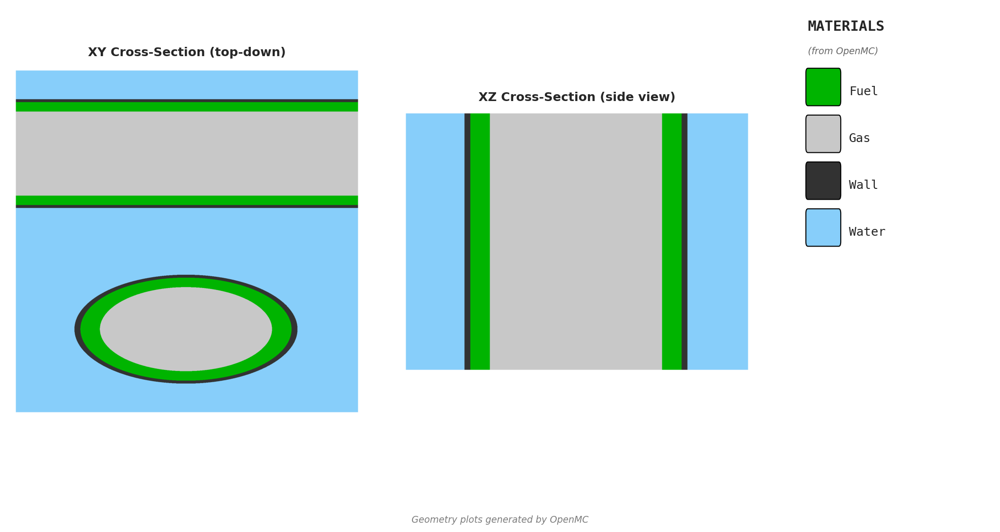

# Pipe Cross Model Handoff

## Purpose

This document is the reviewer-facing handoff for the canonical
`pipe-cross-model` used in crit-buddy.

Its purpose is to help a criticality safety reviewer understand:

- what physical system the model represents
- what inputs engineers are allowed to change
- what assumptions are fixed in the template
- how materials are defined
- how the model is run in OpenMC
- how the OpenMC implementation compares against the MCNP reference basis
- how engineers have used the model so far
- how sensitive `k-effective` is to the current one-parameter sweeps

This handoff supports engineering review and traceability. It is not the final
licensed MCNP deliverable.

## Model Overview

The pipe cross model is a reflected orthogonal pipe-crossing unit cell built for
`AD-7` parity and early engineering exploration. The current benchmarked basis
is the reflective `xz` crossing: one z-directed pipe centered at the origin and
one x-directed pipe offset in `+y`. The model also supports an `xyz` extension
that adds a y-directed crossing, but the frozen cross-solver benchmark in this
handoff is for the `xz` configuration.

Each pipe contains:

- a central `UF6` gas core
- an annular `UO2F2` fuel region
- a structural wall

The remainder of the reflected box is filled with water moderator.

For the benchmarked `xz` reference geometry:

- pipe outer radius = `5.715 cm`
- pipe wall thickness = `0.3048 cm`
- gas core radius = `4.4102 cm`
- fuel outer radius = `5.4102 cm`
- center-to-center offset = `2 * pipe outer radius + separation`
- outer planes are reflective and follow the asymmetric unit-cell bounds from
  the MCNP reference deck

The model is intended to answer questions such as:

- how reactivity changes with crossing separation
- where the `UO2F2` hydration / moderation optimum occurs
- how sensitive the repeated crossing cell is to geometry and material changes

## Visualization

Preview generated from
`models/pipe-cross-model/openmc/visualization_config.yaml` using `--validate`.

## Configurable Parameters

All parameters below are user-configurable through the standard model YAML
interface. The table distinguishes template defaults from the currently frozen
benchmark basis and from the way engineers are expected to use the model.

| Parameter | Meaning | Units | Template default | Typical use | Benchmark / notes |
| --- | --- | --- | --- | --- | --- |
| `cross_mode` | Crossing pattern | - | `xz` | `xz` for current work, `xyz` for extended studies | Frozen benchmark covers `xz` only |
| `enrichment_pct` | U-235 weight percent in `UF6` and `UO2F2` | `%` | `20.2` | Sweep when studying fissile sensitivity | Benchmark uses `20.19`; H/U study uses `20.00` |
| `pipe_size` | Standard pipe registry entry or explicit custom sizing | - | `custom` | Usually left `custom` for parity-style work | Benchmark uses `custom` |
| `pipe_outer_radius_cm` | Pipe outer radius | `cm` | `5.715` | Geometry sweeps | Benchmark uses `5.715` |
| `pipe_wall_thickness_cm` | Pipe wall thickness | `cm` | `0.3048` | Geometry / wall-thickness sweeps | Benchmark uses `0.3048` |
| `gas_core_radius_cm` | Radius of central `UF6` gas core | `cm` | `4.4102` | Geometry sweeps | Must remain below `fuel_outer_radius_cm` |
| `fuel_outer_radius_cm` | Outer radius of annular `UO2F2` layer | `cm` | `5.4102` | Geometry sweeps | Must not exceed pipe inner radius |
| `h_to_u` | Hydrogen-to-uranium atomic ratio in `UO2F2` | - | dry if omitted | Primary moderation / chemistry sweep for new studies | Not used in the frozen 2026-03-30 parity sweep; used in the H/U lookup sweep |
| `uo2f2_density_g_cm3` | Explicit legacy `UO2F2` density override | `g/cm3` | none | Historical replay only | Frozen parity sweep uses `6.37`; avoid for new studies when `h_to_u` is available |
| `uf6_density_g_cm3` | `UF6` gas density | `g/cm3` | `0.0127` | Gas-density sensitivity studies | Benchmark and H/U study use `0.0127` |
| `separation_cm` | Edge-to-edge separation to reflected neighboring crossings | `cm` | `7.0` | Primary spacing sweep | Frozen parity sweep covers `0.0`, `5.8`, `6.5`, `7.0` |
| `wall_material` | Pipe wall material | - | `aluminum` | Material substitution studies | Current benchmark uses `aluminum`; `ss304` is available but not frozen in the current benchmark |
| `moderator_density_g_cm3` | Water moderator density | `g/cm3` | `1.0` | Moderator sensitivity sweeps | Benchmark and H/U study use `1.0` |
| `x_boundary_type` | Boundary at `x` min / max | - | `reflective` | Usually fixed to match unit-cell basis | Benchmark uses `reflective` |
| `y_boundary_type` | Boundary at `y` min / max | - | `reflective` | Usually fixed to match unit-cell basis | Benchmark uses `reflective` |
| `z_boundary_type` | Boundary at `z` min / max | - | `reflective` | Usually fixed to match unit-cell basis | Benchmark uses `reflective` |

## Modeling Assumptions

- The current canonical parity basis is the reflective `xz` crossing, not a
  parallel-pipe model.
- The reflected box intentionally follows the asymmetric MCNP-style unit-cell
  bounds instead of forcing a symmetric convenience box.
- The moderator occupies all system volume outside the pipe outer radii within
  the reflected box.
- The `UF6` gas core and annular `UO2F2` fuel are modeled as separate material
  regions and should be treated as separate parity targets.
- When `h_to_u` is provided, `UO2F2` density is derived from the shared ORNL
  density helper rather than entered manually.
- The legacy `uo2f2_density_g_cm3` override is kept only so historical dry-fuel
  parity configurations can be replayed exactly.
- The default source is a point source at the origin, matching the current
  OpenMC implementation and the MCNP reference notes.
- The current benchmarked basis uses reflective boundaries in `x`, `y`, and
  `z`, so it represents a repeated lattice cell rather than an isolated finite
  system.
- The model includes no burnup, depletion, or absorber-credit treatment. It is a
  static transport model for geometry and material sensitivity work.

## Material Definitions

The pipe cross model uses shared material builders from
`critbuddy/core/materials/` so that parity work and exploratory studies use a
consistent material basis.

Static shared materials used directly in this model:

- `aluminum` or `stainless_steel_304` for the wall
- `water` for the moderator, with density override support and thermal
  scattering

Generated process materials used in this model:

- `uf6(enrichment_pct, density)` for the gas core
- `uo2f2(enrichment_pct, h_to_u, density)` for the annular fuel region

Material basis for each region:

- `UF6` uses the model enrichment to derive uranium isotopics and takes density
  as an explicit input.
- `UO2F2` uses the same enrichment and can derive density from `h_to_u` using
  the shared ORNL/TM-12292 implementation.
- `UO2F2` can also use the legacy explicit density override for historical
  parity reruns.
- Water comes from the shared `water()` builder and retains thermal scattering.
- Wall material comes from the shared static library so wall substitutions are
  controlled and traceable.

Current material references for this model:

- `critbuddy/core/materials/builders.py`
- `critbuddy/core/materials/material_specs.py`
- `critbuddy/core/materials/uo2f2_physics.py`
- `docs/references/materials/README.md`
- `docs/references/materials/uo2f2-density-basis.md`

For the 2026-03-30 benchmark checkpoint, the MCNP cases were assembled using
the same OpenMC builder material values for the parity comparison rather than a
separate hand-entered material basis.

## Solver / Analysis Setup

The OpenMC implementation lives in `openmc/model.py` under this model folder.
It builds the geometry from derived template parameters and writes standard
OpenMC exported case files for each run.

Current solver setup:

- run mode: eigenvalue
- particles per batch: `4800`
- total batches: `200`
- inactive batches: `50`
- source: `IndependentSource(Point((0.0, 0.0, 0.0)))`

For each case, crit-buddy can preserve:

- `materials.xml`
- `geometry.xml`
- `settings.xml`
- `results.csv`
- `REPORT.md`
- summary plots

The frozen parity checkpoint for this model is driven from:

- `certifications/pipe-cross-model/2026-03-30-r1/openmc/study.yaml`

That checkpoint stores both the OpenMC case exports and the rerunnable MCNP
case directories used for comparison.

## Benchmarking

The benchmark basis for this handoff is the frozen separation sweep under
`certifications/pipe-cross-model/2026-03-30-r1/`.

Reference basis:

- physical basis: reflected `x-z` pipe crossing from the `AD-7` workbook
- reference deck: `models/pipe-cross-model/mcnp/reference.inp`
- interpretation notes: `models/pipe-cross-model/mcnp/REFERENCE_ANALYSIS.md`
- OpenMC parity config: `certifications/pipe-cross-model/2026-03-30-r1/openmc/study.yaml`

Compared cases:

- `sep_0.0`
- `sep_5.8`
- `sep_6.5`
- `sep_7.0`

Benchmark comparison:

| Case | MCNP keff | OpenMC keff | MCNP std | OpenMC std | Delta keff |
| --- | ---: | ---: | ---: | ---: | ---: |
| `sep_0.0` | 1.09818 | 1.10710 | 0.00080 | 0.00116 | +0.00892 |
| `sep_5.8` | 0.97525 | 0.98513 | 0.00085 | 0.00124 | +0.00988 |
| `sep_6.5` | 0.95600 | 0.96435 | 0.00078 | 0.00117 | +0.00835 |
| `sep_7.0` | 0.94355 | 0.95080 | 0.00081 | 0.00111 | +0.00725 |

Benchmark observations:

- Maximum absolute `Delta keff` in the frozen checkpoint is `0.00988`.
- The current discrepancy is consistently positive: OpenMC is higher than MCNP
  for all four benchmarked separation cases.
- The trend with separation is reproduced cleanly in both solvers: increasing
  separation lowers `k-effective`.
- The 2026-03-30 rerun reproduced the prior 2026-03-24 checkpoint values to the
  same reported precision.

Benchmark interpretation:

The current benchmark is sufficient for the model's intended role as an
engineering exploration tool for relative trend evaluation and early design
screening. The known positive bias should be treated as an explicit limitation,
not ignored. Final safety basis work should still be translated into the
consultant's qualified MCNP workflow and verified there.

## Engineering Use of the Model

To date, this model has mainly been used in two ways.

1. As a solver-to-solver parity model for the canonical reflected `xz` pipe
   crossing, especially to understand how `k-effective` changes with pipe
   separation while keeping the underlying geometry family fixed.
2. As an exploratory OpenMC model for one-parameter moderation studies,
   especially `H/U` sweeps used to locate the peak-reactivity region before
   broader design studies are built.

In practice, systems engineers can use this model as a starting point for:

- separation or spacing studies
- `H/U` sensitivity checks
- wall material substitution checks
- moderator sensitivity checks
- bounding studies on repeated crossing geometries

The current study history is still relatively small. This handoff should be
treated as the baseline package for future design-space studies built from the
same canonical model.

## Parameter Sensitivity / Lookup Sweeps

This section collects simple one-parameter sweeps that can serve as lookup
tables for future engineering work.

### Separation sweep

Fixed basis:

- model: `pipe-cross-model`
- geometry: reflective `xz` crossing
- enrichment: `20.19 wt%`
- `UF6` density: `0.0127 g/cm3`
- `UO2F2` density: explicit `6.37 g/cm3` legacy parity basis
- wall material: `aluminum`
- moderator density: `1.0 g/cm3`

Coarse broad-sweep results:

| Separation (cm) | OpenMC keff | OpenMC std | MCNP keff | Delta keff |
| ---: | ---: | ---: | ---: | ---: |
| 0.0 | 1.10710 | 0.00116 | 1.09818 | +0.00892 |
| 5.8 | 0.98513 | 0.00124 | 0.97525 | +0.00988 |
| 6.5 | 0.96435 | 0.00117 | 0.95600 | +0.00835 |
| 7.0 | 0.95080 | 0.00111 | 0.94355 | +0.00725 |

Interpretation:

`k-effective` decreases monotonically as the reflected crossings are pulled
apart. For the current benchmark basis, the `gap = 0` case is the most reactive
point in the frozen separation sweep.

### H/U sweep

Fixed basis:

- model: `pipe-cross-model`
- geometry: reflective `xz` crossing
- separation: `0.0 cm`
- enrichment: `20.00 wt%`
- `UF6` density: `0.0127 g/cm3`
- wall material: `aluminum`
- moderator density: `1.0 g/cm3`
- `UO2F2` density: derived from `h_to_u` using the shared ORNL basis

Results:

| H/U | UO2F2 density (g/cm3) | OpenMC keff | std | k+2sigma | status |
| ---: | ---: | ---: | ---: | ---: | --- |
| 0 | 6.422134 | 1.10771 | 0.00114 | 1.10999 | CRITICAL |
| 1 | 6.183823 | 1.11114 | 0.00120 | 1.11353 | CRITICAL |
| 2 | 5.921233 | 1.11103 | 0.00114 | 1.11331 | CRITICAL |
| 3 | 5.634365 | 1.11318 | 0.00122 | 1.11561 | CRITICAL |
| 4 | 4.751854 | 1.10160 | 0.00118 | 1.10396 | CRITICAL |
| 5 | 4.334983 | 1.09488 | 0.00118 | 1.09725 | CRITICAL |
| 6 | 4.001440 | 1.08802 | 0.00134 | 1.09069 | CRITICAL |
| 7 | 3.728509 | 1.08069 | 0.00126 | 1.08321 | CRITICAL |
| 8 | 3.501045 | 1.07392 | 0.00121 | 1.07634 | CRITICAL |
| 9 | 3.308561 | 1.06926 | 0.00124 | 1.07173 | CRITICAL |
| 10 | 3.143563 | 1.05944 | 0.00114 | 1.06172 | CRITICAL |
| 20 | 2.249645 | 0.99010 | 0.00104 | 0.99218 | MARGINAL |
| 30 | 1.881473 | 0.92652 | 0.00128 | 0.92907 | SAFE |
| 40 | 1.680631 | 0.87366 | 0.00115 | 0.87596 | SAFE |
| 50 | 1.554166 | 0.82409 | 0.00108 | 0.82626 | SAFE |

Interpretation:

- The coarse broad sweep again places the highest sampled point at `H/U = 3`.
- A refined rerun on `2026-04-05` using the staged study in
  `studies/pipe-cross-hu-sweep/` found a slightly higher sampled point at
  `H/U = 3.5` with `k-eff = 1.11426 +/- 0.00121` and `k+2sigma = 1.11669`.
- The low-hydration maximum remains broad; `H/U = 2.5-3.5` behaves like the
  peak region within Monte Carlo uncertainty.
- Reactivity falls steadily as hydration increases beyond that peak.
- On the sampled broad grid, the transition from clearly supercritical to
  subcritical behavior occurs between `H/U = 20` and `H/U = 30`.

This H/U sweep is useful as an engineering lookup table, but it is not the same
thing as the frozen OpenMC/MCNP benchmark. It should be treated as an OpenMC
exploration result built on the same model family.

## Limitations

- The frozen 2026-03-30 cross-solver benchmark covers the reflective `xz`
  crossing only.
- The `xyz` mode exists in code but is not backed by the same frozen MCNP/OpenMC
  comparison in this handoff.
- The current benchmark shows a consistent positive OpenMC bias of about
  `+0.007` to `+0.010 delta keff` relative to MCNP across the separation sweep.
- The H/U lookup sweep is currently an OpenMC-only study. It has not been
  benchmarked point-by-point against MCNP in the same way as the frozen
  separation sweep.
- The reflected boundary conditions represent an idealized repeated-lattice cell,
  not a full plant-specific finite system.
- The legacy explicit `uo2f2_density_g_cm3` input remains in the model for
  historical replay; new studies should prefer `h_to_u` so the material basis
  stays tied to the shared density model.
- Final safety conclusions, licensing work, and qualified V&V still belong in
  the consultant's MCNP workflow.

## Appendix

### Reference MCNP model

- [reference.inp](mcnp/reference.inp)
- [REFERENCE_ANALYSIS.md](mcnp/REFERENCE_ANALYSIS.md)

### Reference OpenMC model

- [model.py](openmc/model.py)
- [__init__.py](__init__.py)

### Material library

- [builders.py](../../critbuddy/core/materials/builders.py)
- [material_specs.py](../../critbuddy/core/materials/material_specs.py)
- [uo2f2_physics.py](../../critbuddy/core/materials/uo2f2_physics.py)
- [README.md](../../docs/references/materials/README.md)
- [uo2f2-density-basis.md](../../docs/references/materials/uo2f2-density-basis.md)

### Supporting benchmark and sweep artifacts

- [results.md](../../certifications/pipe-cross-model/2026-03-30-r1/results.md)
- [study.yaml](../../certifications/pipe-cross-model/2026-03-30-r1/openmc/study.yaml)
- [REPORT.md](../../certifications/pipe-cross-model/2026-03-30-r1/openmc/results/REPORT.md)
- [report.md](../../studies/pipe-cross-hu-sweep/report.md)
- [experiment-plan.md](../../studies/pipe-cross-hu-sweep/experiment-plan.md)
- [01_broad_sweep.yaml](../../studies/pipe-cross-hu-sweep/configs/01_broad_sweep.yaml)
- [02_refined_sweep.yaml](../../studies/pipe-cross-hu-sweep/configs/02_refined_sweep.yaml)
