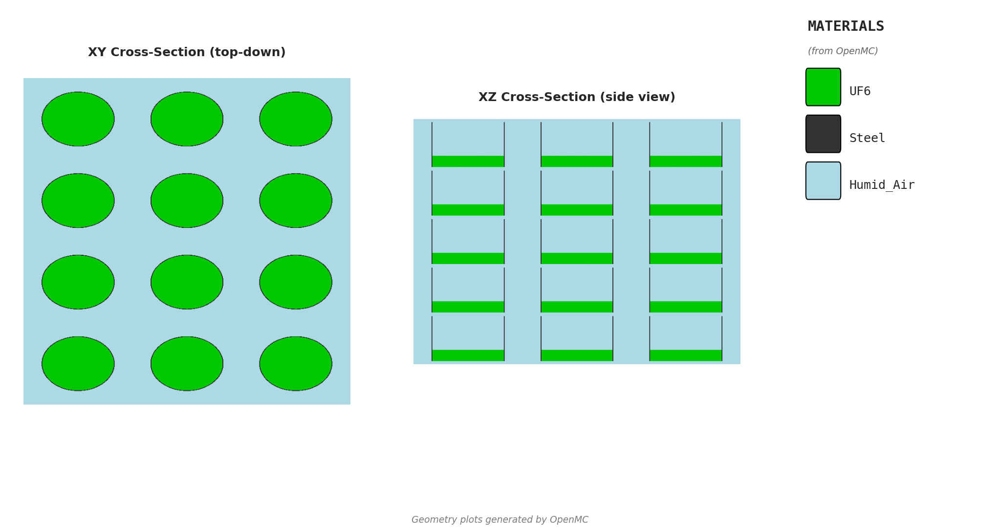

# Cylinder Array Independent Review (Assumptions)

- **Report name:** cylinder-array-review
- **Date:** 2026-02-27
- **Prepared by:** Crit-Buddy (independent review)
- **Units:** cm and g/cc
- **Solver basis:** OpenMC model in `templates/cylinder/openmc/model.py`, reproduced in MCNP
- **Nuclear data (OpenMC):** ENDF/B-VII.1 HDF5
- **Temperature:** 293 K

---

## 1. Overview (What This Case Is)
This is a 3 x 4 x 5 **infinite array** of identical vertical cylinders. Each cylinder has a fissile core
(UF6 or UO2F2), a steel wall shell, and flat steel top/bottom caps. The array is surrounded by humid air,
with **reflective boundary conditions** on all six outer planes to represent an infinite array.

Three case families are covered:
- Dry UF6 fill sweep
- Wet UO2F2 fill sweep
- UO2F2 H/U sweep at full fill



---

## 2. Common Geometry Inputs
| Parameter | Value |
|---|---:|
| Rows x Cols x Layers | 3 x 4 x 5 |
| Inner radius | 12.70 |
| Internal height | 100.0 |
| Wall thickness | 0.3175 |
| Wall material | Steel (SS316 approximation) |
| Horizontal gap (wall-to-wall) | 12.70 |
| Vertical gap (wall-to-wall) | 7.62 |
| Environment | Humid air |
| Boundary | Reflective |
| Reflector thickness | 6.35 |

---

## 3. Materials Summary
| Material | Density | Composition Basis |
|---|---|---|
| UF6 | 5.09 | `materials.py:create_uf6` (U-235/U-238 from wt% + F-19) |
| UO2F2 | `uo2f2_density(h_to_u)` | `materials.py:create_uo2f2` (U, O, F, H per H/U) |
| Steel | 8.0 | `materials.py:create_steel` (Fe, Cr, Ni, Mo, Mn) |
| Humid air | 0.0011 | `materials.py:create_humid_air` (N, O, Ar, H) |

**Thermal scattering:** apply `lwtr` (OpenMC `c_H_in_H2O`) for UO2F2 when H/U > 0.

**UO2F2 density table (H/U sweep)**
```text
H/U    Density (g/cc)
0      6.3700
5      3.7804
10     2.8758
15     2.4153
20     2.1364
25     1.9493
30     1.8151
40     1.6354
50     1.5207
75     1.3587
100    1.2736
```

---

## 4. Physics and Run Settings
| Parameter | Value |
|---|---|
| Run mode | Eigenvalue |
| Particles per batch | 10,000 |
| Total batches | 150 |
| Inactive batches | 50 |
| Active batches | 100 |
| Total histories | 1,000,000 |

**Source distribution (OpenMC box):**
- x: -45.0850 to 45.0850
- y: -64.4525 to 64.4525
- z: -241.5100 to 241.5100

**MCNP guidance:** `KCODE 10000 1.0 50 150`, with `KSRC` or `SDEF` box matching the bounds above.

---

## 5. Assumptions and Limits
- Room temperature (293 K).
- No burnup or depletion.
- No absorber credit.
- Flat end caps.

---

## 6. Source of Truth (Python Models Included)
- `source/cylinder_template.py` (defaults + derived geometry)
- `source/cylinder_openmc_model.py` (geometry + settings)
- `source/materials.py` (materials + densities)
